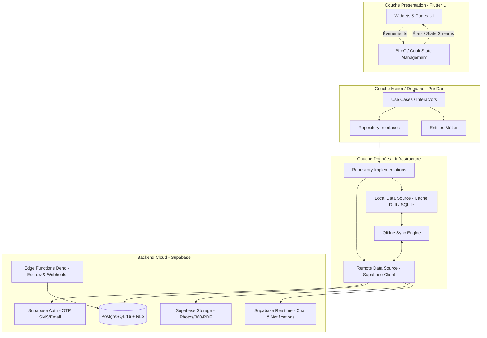
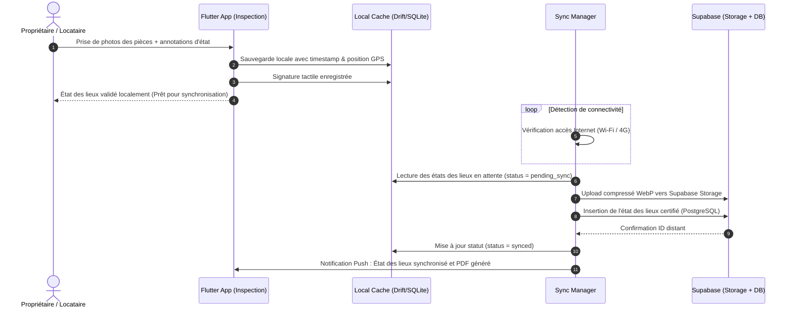
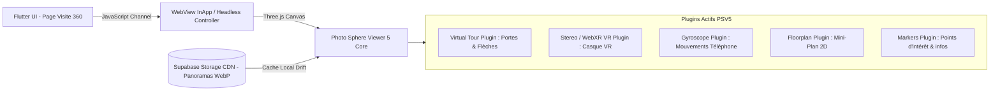
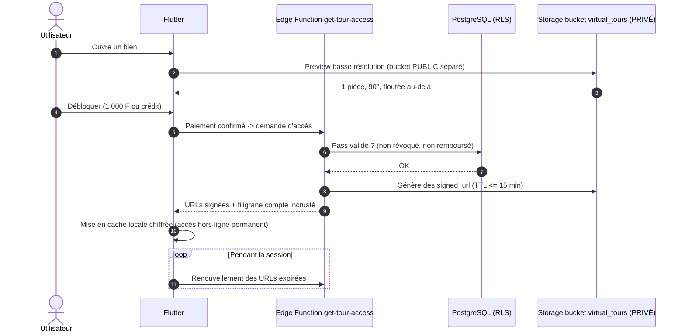
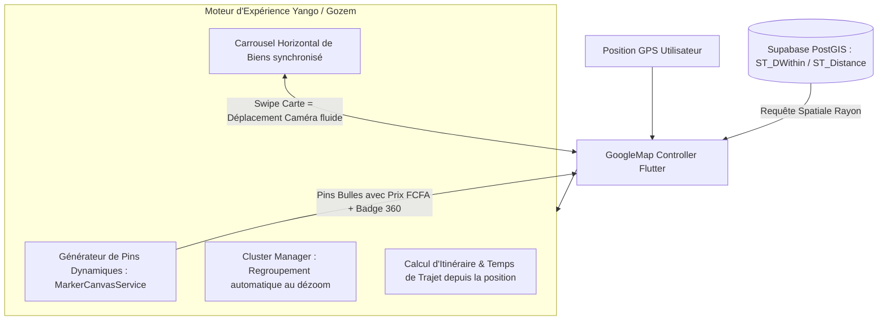

# 🏗️ EAZYRENT - Architecture Technique & Spécifications Système
**Version :** 2.0.0 — révisée après `AUDIT_COHERENCE_BENIN.md`  
**Framework :** Flutter (Dart 3.x) **Android-first** - Clean Architecture + BLoC  
**Backend :** Supabase (PostgreSQL, RLS, Edge Functions, Realtime, Storage)  
**Paiements :** FedaPay / KkiaPay (CinetPay en repli) — MTN MoMo, Moov Africa Flooz, Celtiis Cash, carte bancaire  
**Cartographie :** `google_maps_flutter` (techno unique)

---

## 1. 🏛️ Vue d'Ensemble de l'Architecture Flutter

L'application Flutter adopte une **Clean Architecture** stricte combinée au patron **BLoC (Business Logic Component)** pour garantir une testabilité maximale, une séparation nette des responsabilités et une maintenabilité à long terme.



---

## 2. 📁 Structure du Projet Flutter

```
lib/
├── core/
│   ├── config/              # Configuration des environnements (Dev, Staging, Prod)
│   ├── constants/           # Couleurs, styles, espacements, endpoints
│   ├── errors/              # Exceptions personnalisées & Failures (Either<Failure, T>)
│   ├── network/             # Client HTTP, intercepteurs, connectivité (InternetConnectionChecker)
│   ├── services/            # Notifications (FCM), Géolocalisation, PDF Generator
│   ├── theme/               # Thème clair / sombre, design tokens
│   ├── utils/               # Formateurs de monnaie (FCFA), dates, validateurs de formulaires
│   └── widgets/             # Composants UI réutilisables (Boutons, Inputs, Cartes d'annonces)
│
├── features/
│   ├── auth/                # Authentification OTP, inscription par profil, gestion de session
│   ├── kyc/                 # Vérification d'identité, upload CNI, RCCM, titres de propriété
│   ├── listings/            # Recherche, filtres UEMOA, feed d'annonces, détail, visite 360°
│   ├── map/                 # Carte interactive google_maps_flutter, calcul d'itinéraire
│   ├── bookings_visits/     # Prise de RDV, calendrier partagé, confirmation
│   ├── escrow_payments/     # Séquestre, paiement Mobile Money (Wave, OM, MTN), quittances
│   ├── inspection/          # État des lieux numérique, capture photo certifiée, mode hors-ligne
│   ├── lease_contracts/     # Contrats de bail numériques, signature tactile, export PDF
│   ├── chat_messaging/      # Messagerie instantanée en temps réel avec Supabase Realtime
│   ├── agency_dashboard/    # Tableau de bord agence, stats de rentabilité, multi-gestion
│   └── profile_settings/    # Profil utilisateur, gestion des alertes, langues (FR/EN)
│
└── main.dart
```

---

## 3. 🔐 Sécurité & Supabase Row Level Security (RLS)

Toutes les données sensibles transitent par des politiques de sécurité strictes au niveau de la base PostgreSQL :

1. **Isolation des données Locataires vs Bailleurs** : Un locataire ne peut consulter que ses propres candidatures, baux et quittances.
2. **Protection des documents KYC** : Les pièces d'identité et titres fonciers déposés dans `storage.kyc_documents` ne sont accessibles qu'au dépositaire et aux super-administrateurs EAZYRENT.
3. **Immutabilité des transactions financières** : La table `escrow_transactions` ne peut être modifiée que par les fonctions sécurisées `SECURITY DEFINER` (déclenchées par les Edge Functions après vérification de signature cryptographique du webhook Mobile Money).

---

## 4. 📲 Architecture Offline-First pour l'État des Lieux

L'état des lieux numérique doit être utilisable dans des sous-sols ou des zones à connectivité dégradée :



---

## 5. 💳 Passerelle de Paiement & Flux Webhook (Zone UEMOA)

### 5.1 Agrégateurs supportés — Bénin

> ⚠️ Correction v2.0 : ni **Wave** ni **Orange Money** n'opèrent au Bénin, et **Paystack** ne couvre pas le Mobile Money béninois. La v1.0 était calibrée pour la Côte d'Ivoire et le Sénégal.

- **FedaPay** et **KkiaPay** (agrégateurs béninois, intégration native MTN et Moov, support local) — intégrations principales.
- **CinetPay** en repli régional.
- Canaux couverts : **MTN MoMo** (leader), **Moov Africa Flooz**, **Celtiis Cash**, cartes Visa/Mastercard (diaspora), en XOF.

### 5.1 bis Détention des fonds — 🔴 point bloquant

Le séquestre implique de conserver des fonds appartenant à des tiers. Dans l'espace UEMOA, cette activité relève de la réglementation BCEAO. EAZYRENT ne dispose pas de ce statut.

Deux montages sont recevables et doivent être arbitrés **avant tout développement de la Phase 3** :
1. **Compte de cantonnement** ouvert au nom d'EAZYRENT chez une banque partenaire, les fonds n'entrant jamais dans son bilan d'exploitation ;
2. **Délégation de conservation** à l'agrégateur agréé (FedaPay / KkiaPay), EAZYRENT n'étant qu'ordonnateur des libérations.

Voir `AUDIT_COHERENCE_BENIN.md` §6 R-1 et `GATES.md` G8 (handoff juridique).

### 5.2 Flux de traitement d'une transaction de Séquestre
1. **Initiation** : L'application Flutter appelle la Supabase Edge Function `create-escrow-payment`.
2. **Lien de paiement sécurisé** : L'Edge Function génère une référence unique, enregistre la transaction avec le statut `PENDING`, et retourne l'URL/SDK de paiement.
3. **Paiement Mobile Money** : L'utilisateur valide sur son téléphone (Push USSD ou application Wave).
4. **Webhook sécurisé** : L'agrégateur notifie l'Edge Function `webhook-payment-callback` avec vérification de la signature HMAC-SHA256.
5. **Mise à jour du Séquestre** : La fonction SQL `process_escrow_deposit()` passe les fonds en `HELD_IN_ESCROW` et notifie les deux parties.
6. **Déblocage (Release)** : Lors de la signature de l'état des lieux d'entrée, `release_escrow_funds()` crédite le portefeuille du propriétaire (déduction faite des frais de plateforme).

---

## 6. 🥽 Moteur de Visite Virtuelle 360° & Réalité Virtuelle (VR)

### 6.1 Analyse Comparative : Pannellum vs Technologies Modernes

| Critères | **Pannellum (Ancien)** | **Marzipano (Google)** | **Photo Sphere Viewer 5 (Three.js - Recommandé)** |
| :--- | :--- | :--- | :--- |
| **Moteur sous-jacent** | WebGL 1.0 basique | WebGL personnalisé | **Three.js (WebGL 2.0 / WebGPU ready)** |
| **Mode Réalité Virtuelle (VR)** | Cardboard basique non maintenu | Limité | **Complet (Plugin WebXR & Stereo split-screen natif)** |
| **Navigation Multi-pièces** | Hotspots statiques simples | Manuel par code | **Plugin Virtual Tour complet avec transitions animées** |
| **Contrôle Gyroscopique** | Basique (DeviceOrientation) | Non optimisé | **Plugin Gyroscope haute précision avec filtre Kalman** |
| **Mini-plan / Radar 2D** | ❌ Non supporté nativement | ❌ Non supporté | **Plugin Floorplan & Mini-Map intégré** |
| **Performance sur Mobile** | Correcte sur images légères | Excellente (Tuiles) | **Excellente (Rendu matériel 60/120 fps fluide)** |
| **Écosystème & Maintenance** | Maintenance lente | Projet mature mais figé | **Très actif (TypeScript moderne, v5.x)** |

### 6.2 Architecture d'Intégration Flutter + Photo Sphere Viewer 5
Pour garantir une expérience 60fps sans latence, le moteur 360°/VR est intégré sous forme d'un bundle local optimisé dans l'application Flutter :



### 6.3 Mode VR Stéréoscopique & Gyroscope
1. **Mode Standard (Au doigt & Gyroscope)** — priorité 1. L'utilisateur navigue en glissant son doigt sur l'écran ou en pivotant son smartphone.
2. **Mode Casque VR (Double lentille Stéréoscopique)** — ⚫ **différé hors du chemin critique du MVP.** Le parc de casques VR au Bénin est quasi nul ; le coût de développement, de QA et de poids d'application n'est pas justifié par l'usage. Conservé comme **outil de démonstration terrain** (stands, tournées de quartier, agences partenaires), où l'effet de bouche-à-oreille est disproportionné par rapport au coût.

### 6.4 🔒 Étanchéité du paywall — spécification obligatoire

Défaut bloquant de la v1.0 : `virtual_tour_scenes.panorama_url` était lisible via l'API PostgREST sans RLS, rendant le Pass à 1 000 F contournable par simple partage d'URL.



**Règles non négociables :**
1. Bucket `virtual_tours` **privé** ; aucune URL publique persistée en base.
2. RLS active sur `virtual_tour_scenes`, `virtual_tour_hotspots`, `virtual_tour_access_passes`.
3. `signed_url` d'une durée ≤ 15 minutes, renouvelées en session.
4. **Preview gratuite** servie depuis un bucket public **séparé** : elle est conçue pour circuler, c'est l'appât.
5. Filigrane serveur portant l'identifiant du compte sur les panoramas complets.
6. Une fois payé, le tour est **mis en cache local chiffré** et reste accessible hors-ligne : on a payé, on possède.

### 6.5 Budget de performance sur le parc réel

Parc cible : Android 10-13, 2 à 4 Go de RAM, GPU Mali-G52 et inférieurs (Tecno, Infinix, itel, Samsung A). Le « 60/120 fps » de la v1.0 n'est pas tenable partout.

| Contrainte | Valeur |
| :--- | :--- |
| Résolution de panorama | Adaptative : 4K sur entrée de gamme, 6K max sur milieu de gamme |
| Poids par scène (WebP) | ≤ 1,5 Mo |
| Poids d'un tour complet (8 scènes) | ≤ 12 Mo, chargement progressif par tuiles |
| Taille de l'APK | ≤ 30 Mo (distribution par partage direct WhatsApp / Bluetooth à préserver) |
| Mode économie de données | Obligatoire, activé par défaut hors Wi-Fi |

---

## 7. 🗺️ Moteur Cartographique Haute Précision : Style Yango / Gozem

Pour offrir une expérience fluide, ultra-précise et familière aux utilisateurs de la zone UEMOA (calquée sur les standards de **Yango** et **Gozem**), le module cartographique repose sur **`google_maps_flutter`** avec un moteur de rendu personnalisé :



### 7.1 Fonctionnalités Clés du Mode Carte
1. **Marqueurs Dynamiques Personnalisés (Custom Bubble Pins)** :
   - Les marqueurs ne sont pas de simples épingles génériques, mais des **badges pilules interactifs** affichant directement le loyer (ex: `150 000 F`), la mention `Terrain CPF` ou un badge `Visite Vérifiée`.
   - Lorsqu'un marqueur est sélectionné, il s'agrandit avec un halo terracotta vibrant et déclenche un retour haptique.
2. **Synchronisation Bi-directionnelle Marqueurs ↔ Carrousel Horizontal** :
   - En bas de l'écran, un carrousel horizontal présente les fiches détaillées des biens visibles.
   - *Faire défiler les fiches* déplace automatiquement la caméra Google Maps sur le bien correspondant avec une animation douce (`animateCamera`).
   - *Cliquer sur un marqueur* fait défiler le carrousel sur la fiche correspondante.
3. **Thème de Carte Sombre / Clair Personnalisé (Custom Map Style JSON)** :
   - Carte épurée sans encombrement inutile (masquage des commerces parasites, accentuation des axes routiers et repères de quartier connus).
4. **Calcul d'Itinéraire & Distance Réelle** :
   - Affichage en temps réel de la distance (en kilomètres) et de la polyline d'itinéraire depuis la position actuelle de l'utilisateur.

---

## 8. 🌐 Stack Technologique Détaillée

| Domaine | Technologie choisie | Justification technique |
| :--- | :--- | :--- |
| **Framework Mobile** | Flutter 3.x + Dart 3.x | Multiplateforme native fluide (60/120 fps), rendu graphique cohérent via Impeller. |
| **Cartographie & GPS** | **`google_maps_flutter`** + PostGIS | Précision maximale en Afrique, couverture routière optimale et rendu style Yango/Gozem. |
| **Système Iconographique** | **`iconsax_flutter`** + SVGs UEMOA | Zéro AI Slop : icônes modernes, traits 1.5px fins et badges personnalisés. |
| **Typographie** | *Plus Jakarta Sans* + *Inter* | Duo typographique d'élite avec chiffres tabulaires (`tabularFigures`) pour les FCFA. |
| **Moteur Visite 360° & VR** | Photo Sphere Viewer 5 + Three.js | Le moteur open-source le plus complet pour les visites multi-pièces et casques VR. |
| **Gestion d'État** | flutter_bloc (v8.1+) | Découplage strict, flux d'événements prédictibles et testabilité aisée. |
| **Injection de Dépendances** | get_it + injectable | Résolution de dépendances rapide et typée à la compilation. |
| **Base de Données Locale** | drift (SQLite ORM) | Requêtes typées en Dart, migrations automatiques et performance optimale. |
| **Backend & BDD Distante** | Supabase (PostgreSQL 16) | Solution BaaS ouverte, RLS native, authentification OTP et fonctions Edge Deno. |
| **Génération PDF** | pdf (Dart) + printing | Génération locale et côté serveur de baux officiels et quittances horodatées. |

