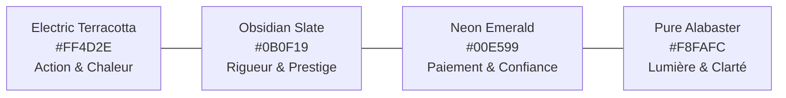

# 🎨 EAZYRENT - Charte Graphique & Direction Artistique (Brand Identity)
**Version :** 1.0.0  
**Statut :** Validé  
**Positionnement :** Tech Immobilière & Séquestre Financier Haut de Gamme (Zone UEMOA & Panafrique)

---

## 1. 🧠 Philosophie & Manifeste de Marque

### 1.1 Le Principe Fondamental : L'Anti-Cliché
> *"Les marques légendaires ne dessinent jamais leur produit dans leur logo. Apple ne dessine pas d'ordinateur, Nike ne dessine pas de chaussure, Airbnb ne dessine pas de maison."*

Pour **EAZYRENT**, nous bannissons immédiatement :
- ❌ Les toits pointus triangulaires de maisonnettes.
- ❌ Les clés, serrures ou poignées de porte.
- ❌ Les briques ou contours d'immeubles génériques.

### 1.2 Ce que le Logo EAZYRENT Incarne
1. **La Fluidité Absolue ("EAZY")** : La promesse d'une transaction sans friction, d'un clic à la remise des clés.
2. **Le Portail Spatial & l'Immersion (360° / VR)** : Une perspective continue, le sentiment d'ubiquité et de vision complète.
3. **Le Nœud de Confiance (Escrow / Sécurité)** : Une boucle fermée, protectrice et inviolable pour les fonds financiers.

---

## 2. 💎 Le Concept du Logo : *Le Portail Nexus "E"*

```
       ┌─────────────────────────────┐
       │   ██████████████████        │  ◄── Ligne supérieure : L'Horizon & la Projection
       │   ██              ██        │
       │   ██    ████████████        │  ◄── Barre centrale : Le Pont de Connexion (Escrow)
       │   ██              ██        │
       │   ██████████████████        │  ◄── Ligne inférieure : L'Assise & la Sécurité
       │           ▼                 │
       │    [ Boucle Spatiale 360° ] │  ◄── Perspective isométrique continue
       └─────────────────────────────┘
```

### 2.1 Description Visuelle du Symbole
- **Forme** : Un ruban continu en ruban de Möbius formant le monogramme **'E'** stylisé et dynamique.
- **Mouvement** : Les extrémités créent une ouverture et un flux à 360° (évocation du champ visuel et de la visite VR), tout en conservant une géométrie équilibrée et stable.
- **Impact & Mémorabilité** : Fonctionne parfaitement en micro-icône d'application mobile (16x16px), en favicon, brodé sur les uniformes de vos agents de terrain ou affiché en 3D volumétrique dans les casques VR.

---

## 3. 🎨 Palette de Couleurs (Color System)

La palette combine la **chaleur et la terre africaine**, la **rigueur d'une fintech bancaire** et **l'énergie futuriste de la tech spatiale**.



### 3.1 Couleurs Primaires
- **Terracotta Électrique (`#FF4D2E` / `HSL(9, 100%, 59%)`)** :
  - *Rôle* : Couleur signature, boutons d'action primaire (CTA), badge "Pass Visite 360°".
  - *Symbolique* : Terre latéritique africaine sublimée, hospitalité, audace, énergie solaire.
- **Obsidienne Profonde (`#0B0F19` / `HSL(223, 41%, 7%)`)** :
  - *Rôle* : Arrière-plans Dark Mode, typographies fortes, fond des visites immersives 360°.
  - *Symbolique* : Sécurité institutionnelle, élégance intemporelle, contraste premium.

### 3.2 Couleurs Secondaires & Accents
- **Émeraude Néon (`#00E599` / `HSL(160, 100%, 45%)`)** :
  - *Rôle* : Succès des paiements Mobile Money (Wave/OM/MTN), statut "Séquestre Validé", badge "Certifié EAZYRENT".
  - *Symbolique* : Richesse, validation financière, sérénité.
- **Bleu Cyan Spatial (`#00B4D8`)** :
  - *Rôle* : Indicateurs de réalité virtuelle (VR Mode), hotspots 360°, boussole et mini-plan.
- **Albâtre Pur (`#F8FAFC`) & Gris Platine (`#E2E8F0`)** :
  - *Rôle* : Arrière-plans Light Mode, séparateurs doux et cartes de contenu.

---

## 4. 🔤 Typographie & Hiérarchie Visuelle

### 4.1 Police de Titres & Logotype : **Plus Jakarta Sans** (ou **Outfit**)
- **Style** : Sans-serif géométrique, moderne, chaleureuse avec des courbes rondes et des angles précis.
- **Poids utilisés** : `Bold` (700) pour les titres H1/H2 et `ExtraBold` (800) pour le Wordmark.
- **Exemple de Wordmark** : **EAZY**<span style="color:#FF4D2E">RENT</span> (Graisse contrastée avec point de couleur signature).

### 4.2 Police de Corps & Données : **Inter**
- **Style** : Lisibilité technique parfaite sur écrans mobiles de toutes tailles.
- **Poids utilisés** : `Regular` (400), `Medium` (500), `SemiBold` (600).
- **Rôle** : Chiffres de loyer en FCFA, contrats de bail, adresses, spécifications des pièces.

---

## 5. ✨ Direction Artistique UI/UX (Application Flutter)

### 5.1 Style "Bento Tech & Dark Elegance"
- **Rayons de courbure (Border Radius)** : `16px` pour les cartes, `24px` pour les modals et `9999px` (Pilule) pour les boutons d'action et badges.
- **Élévations & Ombres** : Ombres diffuses et colorées (Glow subtil terracotta ou émeraude lors de la sélection).
- **Micro-Interactions & Haptique** :
  - Retour haptique vibrant lors de la validation d'un paiement Mobile Money ou de la signature de l'état des lieux.
  - Transition fluide (Zoom immersif) lorsqu'on passe d'une photo 2D à la visite 360° Photo Sphere Viewer.

---

## 6. 🎙️ Tonalité & Voix de Marque (Brand Voice)

| Attribut | Ce que nous sommes | Ce que nous ne sommes PAS |
| :--- | :--- | :--- |
| **Ton** | Direct, limpide, moderne et rassurant. Tutoiement, phrases courtes, français simple. | Froid, bureaucratique, ou excessivement familier. |
| **Promesse** | *« Visite avant de payer le zem. »* | *"Trouvez des appartements pas chers."* |
| **Garantie** | *« Confirmé disponible aujourd'hui. »* | *"Faites confiance au propriétaire."* |
| **Vocabulaire** | Ce que ça t'évite : le déplacement pour rien, le démarcheur qui fait payer. | Jamais « VR », « immersif », « panorama équirectangulaire » à l'écran. |

> **Révision v2.0 après audit.** La promesse v1.0 (« Visitez comme si vous y étiez ») décrivait la technologie sans dire ce qu'on y gagne. La promesse doit nommer l'économie réalisée : un déplacement à Cotonou coûte 1 500 à 3 000 F entre le zémidjan et le démarcheur ; la Visite Vérifiée coûte 1 000 F. Alternatives à tester sur le terrain : « Vois tout, avant de bouger. » / « Le logement d'abord, le déplacement après. »
> Le mot **« séquestre »** est à remplacer par une formulation comprise localement (« Argent bloqué », « Compte de garantie ») — à tester sur cinq utilisateurs réels avant de figer.
> Réserve à traiter en phase UI : contraste de `#FF4D2E` sur `#0B0F19` et lisibilité de `#00E599` sur écran d'entrée de gamme, en extérieur, en plein soleil — le contexte d'usage réel au Bénin.
