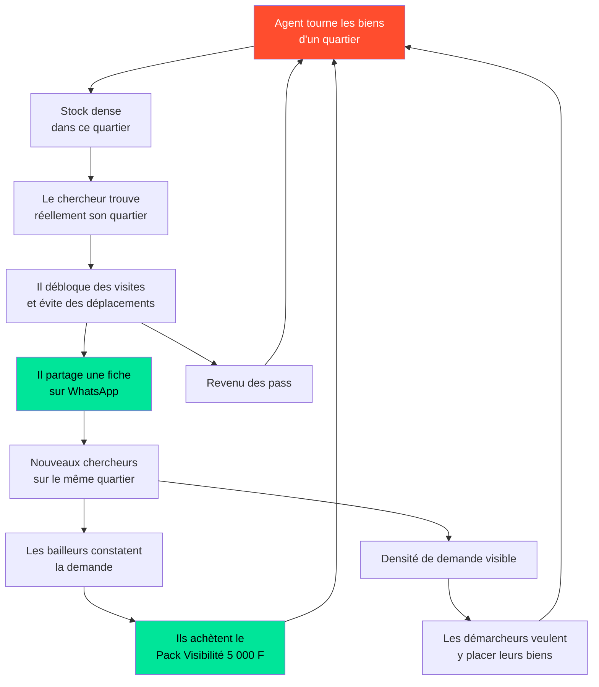

# 💰 EAZYRENT — Modèle économique, acquisition et système marketing

**Marché :** Bénin, Grand Nokoué
**Prix de référence arrêté :** Pass Visite Vérifiée = **1 000 FCFA**
**Ce document répond à :** ce prix tient-il ? comment on remplit le stock ? comment on fait venir les gens et comment on les fait revenir ?

---

## 1. Positionnement

### 1.1 Contre qui on se bat réellement

Le PRD n'en parle pas. C'est pourtant ce qui détermine le prix.

| Concurrent | Force | Faille exploitable |
|---|---|---|
| **Le démarcheur informel** | Connaît le stock réel, présent physiquement, relation de confiance locale | Fait payer le déplacement, montre des biens déjà loués, ne filtre rien, aucune trace |
| **Groupes Facebook / WhatsApp** | Gratuits, énormes, immédiats | Annonces mortes jamais retirées, prix faux, photos volées, aucun moyen de savoir si c'est encore libre |
| **CoinAfrique et petites annonces** | Volume, notoriété | Même problème : aucune vérification, aucune fraîcheur garantie |
| **Agences immobilières** | Formelles, mandats | Chères, peu nombreuses, stock limité au haut de gamme |

**Le trou du marché tient en une phrase :** *personne ne garantit qu'un bien annoncé est encore libre.*

### 1.2 Déclaration de positionnement

> Pour le chercheur de logement du Grand Nokoué qui perd son argent en déplacements inutiles,
> **EAZYRENT est le seul endroit où on voit un logement en entier et où on sait qu'il est encore libre** —
> parce que nos agents filment chaque bien sur place et re-confirment sa disponibilité,
> là où Facebook, les démarcheurs et les autres sites se contentent de relayer des annonces qu'ils n'ont jamais vérifiées.

### 1.3 La phrase qui doit rester

> **« Visite avant de payer le zem. »**

Alternatives à tester terrain : « Vois tout, avant de bouger. » / « Le logement d'abord, le déplacement après. » / « Arrête de payer pour rien. »
La promesse actuelle de la charte (« Visitez comme si vous y étiez ») décrit la technologie ; elle ne dit pas ce qu'on y gagne. À faire évoluer en phase UI.

---

## 2. Économie unitaire du Pass à 1 000 F

### 2.1 Coût de production d'une Visite Vérifiée

Hypothèses explicites, à valider dès les 20 premiers tournages réels.

| Poste | Hypothèse | Coût par bien (tournage groupé, 5 biens/jour, même quartier) |
|---|---|---|
| Temps agent terrain | 75 000 F/mois, 22 j, ~1 h par bien tournage + trajet | ≈ 430 F |
| Déplacement (carburant / zem, mutualisé sur la tournée) | 2 500 F la journée ÷ 5 biens | ≈ 500 F |
| Amortissement caméra 360 + trépied + téléphone | 400 000 F sur 24 mois, ~1 200 biens | ≈ 330 F |
| Post-production (assemblage, hotspots, upload, contrôle) | 25 min | ≈ 180 F |
| Stockage et diffusion (8 scènes, ~12 Mo) | Négligeable au stockage, ~0,7 F par tour servi | ≈ 60 F sur 80 vues |
| **Coût complet par bien tourné** | | **≈ 1 500 F** |

En tournage **non groupé** (un bien isolé, un déplacement dédié) le coût monte à **3 000 – 3 500 F**.
👉 **Règle opérationnelle n°1 : on ne tourne jamais un bien isolé. On tourne par tournée de quartier.**

### 2.2 Revenu net par pass

| Élément | Montant |
|---|---|
| Prix affiché | 1 000 F |
| Frais agrégateur Mobile Money (~2,5 %) | − 25 F |
| Marge du gestionnaire de paiement / arrondi | − 15 F |
| **Net encaissé** | **≈ 960 F** |

### 2.3 Seuil de rentabilité

```
Seuil = coût de production ÷ net par pass
      = 1 500 ÷ 960
      ≈ 1,6 pass payé par bien tourné
```

En intégrant la première visite offerte à chaque nouvel utilisateur et les remboursements en crédit (biens devenus indisponibles), la cible opérationnelle réaliste est :

> **≥ 3 pass payés par bien tourné pour que la production s'autofinance.**
> **≥ 6 pass pour dégager une marge qui finance l'acquisition.**

### 2.4 La contrainte que personne n'a vue : la durée de vie d'un tour

Un bien loué disparaît. Un tour 360 n'a donc qu'une **fenêtre de monétisation de 7 à 30 jours**. Passé ce délai, l'actif vaut zéro.

Trois conséquences directes :

1. **Ne jamais tourner à l'aveugle.** Un bien n'est tourné que s'il a déjà démontré une demande sur sa version photo simple (seuil : ≥ 40 vues ou ≥ 8 mises en liste sous 72 h). On transforme un pari fixe en investissement piloté par la demande. **C'est la décision la plus rentable de tout le modèle.**
2. **La vitesse de diffusion est un actif financier**, pas un confort. L'alerte quartier immédiate (`UX_CORE_SPEC.md` §8) est ce qui permet d'atteindre 6 pass avant que le bien ne parte.
3. **Le stock des quartiers demandés doit être renouvelé en continu.** Un catalogue figé meurt en trois semaines.

### 2.5 Le correctif structurel : faire payer l'offre pour la production

À 1 000 F l'unité, la production reste un pari. Le modèle devient robuste si le **coût de production est couvert par le bailleur** et si chaque pass devient de la marge quasi pure.

| Offre bailleur | Prix | Ce qu'il obtient | Effet sur le modèle |
|---|---|---|---|
| **Annonce simple** | Gratuit | Photos, fiche, demandes de RDV | Alimente le vivier et produit le signal de demande |
| **Pack Visibilité 360** | **5 000 F** | Tournage par un agent EAZYRENT, badge Visite Vérifiée, mise en avant 30 j, alerte poussée aux chercheurs du quartier | Couvre 3,3× le coût de production. **Chaque pass devient marge nette.** |
| **Mandat exclusif** | Gratuit | Tournage offert + priorité de diffusion | Le coût est repris sur la commission de mise en location |

**Argument de vente au bailleur, mesurable :** « Ton annonce a été vue 23 fois cette semaine. Les biens avec Visite Vérifiée reçoivent en moyenne 4× plus de demandes de RDV et se louent en X jours au lieu de Y. » — les chiffres X, Y et le facteur 4 doivent être **mesurés sur les 50 premiers biens**, jamais inventés.

### 2.6 Le segment ignoré et le plus rentable : la diaspora

Un Béninois de Paris, Abidjan ou Montréal qui cherche un logement à Cotonou **ne peut pas se déplacer du tout**. Il dépend aujourd'hui entièrement d'un cousin ou d'un démarcheur, sans aucun contrôle. Pour lui, la Visite Vérifiée n'est pas une économie de 1 000 F : c'est **la seule solution existante**.

- Consentement à payer : sans commune mesure (10 à 20 fois supérieur).
- Moyen de paiement : carte bancaire, sans friction Mobile Money.
- Offre dédiée : **« Recherche à distance »** — 25 000 F : 5 biens tournés sur critères, un agent EAZYRENT en visite commentée en direct par appel vidéo, dossier et bail à distance.
- Canal : groupes Facebook de la diaspora béninoise, WhatsApp familial, associations de ressortissants.

Ce segment est **absent des documents actuels**. Il devrait financer une partie de l'acquisition sur le marché local.

### 2.7 Empilement des revenus

| Source | Payeur | Récurrence | Statut |
|---|---|---|---|
| Pass Visite Vérifiée — 1 000 F | Chercheur | Ponctuelle, 2-6 par recherche | ✅ MVP |
| Pack Visibilité 360 — 5 000 F | Bailleur | Par bien | ✅ MVP — **à ajouter aux docs** |
| Offre Recherche à distance — 25 000 F | Diaspora | Ponctuelle | 🟠 Phase 2 — **à ajouter** |
| Commission de mise en location | Bailleur | Par bail signé | 🔴 Bloqué par la conformité (voir §6 de l'audit) |
| Abonnement agence | Agence | Mensuel | 🟠 Phase 3 |
| Séquestre | — | — | 🔴 Bloqué : statut BCEAO requis |

**Lecture importante :** le MVP finançable est composé du Pass et du Pack Visibilité. **L'escrow, présenté comme le facteur différenciant n°1 du PRD, est le poste le plus lointain et le plus risqué.** Le produit doit pouvoir vivre sans lui.

---

## 3. Politique de prix

### 3.1 Pourquoi 1 000 F est un bon prix

- **C'est un billet.** Le 1 000 FCFA est une coupure physique et un montant Mobile Money évident. Aucun calcul mental, aucune monnaie à rendre. Un prix « psychologiquement rond » se traite sans effort et signale un service assumé — 950 F ou 1 200 F seraient objectivement pires.
- **Il est sous l'ancrage naturel.** Le point de comparaison de l'utilisateur est le coût d'un déplacement (1 500 à 3 000 F zem + démarcheur). Se situer nettement en dessous transforme la dépense en économie.
- **Il est sous le seuil de délibération.** À 1 000 F, on ne consulte pas son conjoint. À 2 500 F, on hésite. Ce seuil est plus important que la marge unitaire.

### 3.2 Ce qu'il faut corriger dans la spec actuelle

| Point actuel | Problème | Correctif |
|---|---|---|
| **Validité 48 h** | Punitif et générateur de litiges. Quelqu'un qui a payé et qui a « perdu » son accès désinstalle et raconte l'histoire autour de lui. | **Accès permanent au bien acheté** tant que l'annonce est en ligne, **et téléchargeable hors-ligne**. On a payé, on possède. |
| **Pas de packs modélisés** | Le PRD promet un pack, la base ne connaît pas la notion de crédit. | Ajouter une table `visit_credits` (solde, origine, expiration). |
| **Aucune politique de remboursement** | Le cas « bien indisponible après achat » n'est pas traité. C'est le point de rupture de confiance. | **Remboursement automatique en crédit, sans réclamation, notifié.** Coût marginal quasi nul, gain de confiance considérable. |
| **Revenus partagés vs 100 %** | Contradiction interne du PRD. | Tranché : **100 % EAZYRENT** sur le Pass ; le bailleur est rémunéré par la location, pas par la visite. |

### 3.3 Grille tarifaire

| Formule | Prix | Prix / visite | Rôle |
|---|---|---|---|
| **Première visite** | **Offerte** | 0 F | Fait vivre la valeur avant de la vendre. Non négociable. |
| **1 visite** | 1 000 F | 1 000 F | Entrée, sans engagement |
| **Pack Quartier — 3 visites** | **2 500 F** | 833 F | 🎯 **Cible.** Correspond exactement au comportement réel : on compare 3 biens. |
| **Pack Chasseur — 7 visites** | 5 000 F | 714 F | Ancre haute qui rend le Pack Quartier évident |
| **Recharge hebdomadaire** | Offerte | 0 F | 1 visite tous les 7 jours pour les comptes actifs : rendez-vous de retour |

Les crédits **n'expirent pas avant 90 jours** — assez pour ne pas être punitif, assez pour ne pas dormir indéfiniment au passif.

### 3.4 Traitement des objections

| Objection réelle | Réponse produit (pas argumentaire) |
|---|---|
| « Pourquoi je paierais alors que Facebook est gratuit ? » | Le compteur d'économies + la mention « Confirmé disponible aujourd'hui » sur chaque fiche. La réponse est un fait affiché, pas un slogan. |
| « Et si je paie et que le bien est déjà pris ? » | Remboursement automatique en crédit, annoncé **avant** le paiement, sur l'écran de paiement. |
| « 1 000 F c'est cher pour juste regarder » | Cadrage à l'écran : « Un aller-retour te coûte environ 2 000 F. » (montant issu de sa propre déclaration à l'onboarding.) |
| « Je ne fais pas confiance aux paiements en ligne » | Montant faible, opérateur familier, confirmation immédiate visible, et **aucun débit en cas d'échec** dit explicitement. |
| « C'est du faux, les photos sont truquées » | Le badge « Tourné par un agent EAZYRENT le 12/03 » avec le prénom et la photo de l'agent. Un humain identifiable, pas un logo. |

---

## 4. Acquisition — le problème est l'offre, pas la demande

### 4.1 L'amorçage à froid

La demande existe déjà et est massive. **C'est le stock qui manque.** Un chercheur qui ouvre l'app et trouve 3 biens dans son quartier ne revient jamais.

> **Règle : ne pas lancer sur le Grand Nokoué. Lancer sur un quartier.**

**Séquence d'amorçage :**
1. Choisir **un quartier à forte rotation locative** (Fidjrossè, Godomey ou Agla — à arbitrer sur données).
2. Constituer **150 à 200 annonces** dans ce seul quartier avant toute communication grand public, dont 40 à 60 avec Visite Vérifiée.
3. Communiquer **uniquement** sur ce quartier : « Tous les logements libres à Fidjrossè, filmés. »
4. Ne s'étendre au quartier suivant qu'après avoir atteint la densité et mesuré la rétention.

La densité perçue vaut mieux que la couverture. Mieux vaut être exhaustif sur un quartier qu'anecdotique sur dix.

### 4.2 Recruter le démarcheur au lieu de le combattre

C'est l'arbitrage stratégique le plus important du dossier — et il est absent des documents.

Le démarcheur connaît 30 à 50 propriétaires dans son quartier. Il est la meilleure force d'acquisition d'offre disponible, et il est aujourd'hui traité implicitement comme l'ennemi.

**Programme « Apporteur EAZYRENT » :**
- 1 000 F par bien apporté, vérifié et publié ;
- 3 000 F supplémentaires si le bien est loué via l'application ;
- Un espace dédié dans l'app pour suivre ses biens et ses gains ;
- Un statut visible (« Apporteur vérifié ») qui a une valeur sociale locale réelle.

Il conserve son revenu, il perd le déplacement inutile. On lui retire la partie de son métier qui nuit à l'utilisateur et on garde celle qui a de la valeur.
👉 **Ajouter le rôle `broker` à `user_role` dans le schéma.** Il n'existe pas.

### 4.3 Canaux, par rendement décroissant

| Canal | Coût | Ce qu'il apporte | Priorité |
|---|---|---|---|
| **WhatsApp** (partage de fiche, statuts, groupes de quartier) | ~0 | Canal n°1. Chaque fiche partageable en lien profond ouvrant la preview même sans l'app. | 🔴 Critique |
| **Apporteurs / démarcheurs** | Variable, à la performance | Le stock. Sans stock, rien d'autre ne compte. | 🔴 Critique |
| **Parrainage double** (« Offre une visite, gagne une visite ») | Marginal, en nature | Croissance organique, coût réel ≈ bande passante | 🔴 Critique |
| **Groupes Facebook logement** | ~0 | Ne pas les concurrencer : y publier avec liens profonds. Le concurrent devient un canal. | 🟠 Élevée |
| **Gilets de zémidjans brandés** | Faible | Affichage mobile permanent dans le trafic de Cotonou, à très faible coût par impression | 🟠 Élevée |
| **Radio locale (FM en français et langues nationales)** | Moyen | Portée réelle et forte crédibilité sur ce marché | 🟠 Élevée |
| **Affichage de quartier + QR code** | Faible | Là où se trouvent physiquement les chercheurs | 🟡 Moyenne |
| **Facebook / TikTok payant** | Moyen | Le format « avant/après le déplacement inutile » se prête bien à la vidéo verticale | 🟡 Moyenne |
| **Diaspora** (groupes, associations de ressortissants) | Faible | Le revenu par utilisateur le plus élevé | 🟠 Élevée |
| **App Store / iOS** | Élevé | Parc marginal au Bénin | ⚫ Différé |

### 4.4 Le contenu qui fonctionne sur ce marché

Un seul format, décliné à l'infini, tourné avec les vrais tours 360 déjà produits :

> **« Ce que le démarcheur ne t'a pas montré. »**
> Photo de l'annonce → tour 360 réel → le détail qui change tout (la cour partagée, l'absence de compteur individuel, la fenêtre qui donne sur un mur).

C'est simultanément une démonstration produit, une preuve d'utilité et un contenu partageable. Coût marginal nul : le matériau est déjà produit.

---

## 5. Boucles de croissance



**Trois boucles, une seule racine.** Tout part du stock tourné. Le facteur limitant de l'entreprise n'est ni le code, ni le marketing : c'est **le nombre de biens tournés par jour et par agent**. Toute la planification devrait s'organiser autour de cette contrainte.

**Capacité :** 1 agent = 5 biens/jour = ~110 biens/mois. Pour tenir 200 biens actifs par quartier avec un renouvellement mensuel de 30 %, il faut ~1 agent pour 2 quartiers. C'est le vrai plan de recrutement, et il n'apparaît nulle part dans la ROADMAP.

---

## 6. Rétention — qui reste, qui part

| Segment | Durée de vie | Ce qui le fait rester | Erreur à éviter |
|---|---|---|---|
| **Chercheur** | 2 à 6 semaines | Fraîcheur du stock, alertes rapides, crédit hebdomadaire | Essayer de le retenir après qu'il a trouvé. Il doit partir **content** : c'est lui qui parle de nous. |
| **Locataire installé** | 12 à 36 mois | Paiement du loyer, quittances archivées, contact du bailleur, signalement de panne | Le laisser sortir du produit après la signature du bail. C'est l'erreur la plus coûteuse. |
| **Bailleur** | Plusieurs années | Demandes qualifiées, suivi des encaissements, taux d'occupation | Le facturer avant de lui avoir prouvé la demande |
| **Agence** | Contractuelle | Dashboard, multi-agents, exports comptables | Livrer un dashboard avant d'avoir du volume à y afficher |
| **Apporteur** | Continue | Revenus visibles et statut | Retarder ses paiements. Un apporteur payé en retard part et parle. |

**Le moment le plus important du produit est la remise des clés.** Règle du pic-fin : c'est le souvenir qui restera et qui déterminera ce que la personne racontera pendant deux ans. Il doit être soigné à l'excès — récapitulatif de ce qui a été économisé, quittance et bail immédiatement disponibles, message personnalisé de l'agent qui a tourné le bien.

---

## 7. Tableau de bord — les chiffres qui pilotent

Le PRD ne contient que des KPI techniques. Voici ceux qui décident.

| Indicateur | Définition | Cible d'amorçage |
|---|---|---|
| ★ **Visites Vérifiées terminées / semaine** | Métrique nord | Croissance hebdomadaire ≥ 15 % |
| **Activation** | % de nouveaux qui terminent un tour à J0 | ≥ 45 % |
| **Conversion payante** | % d'activés qui achètent un pass sous 7 j | ≥ 20 % |
| **Pass par chercheur** | Moyenne sur le cycle de recherche | ≥ 2,5 |
| **Pass par bien tourné** | Rentabilité de la production | ≥ 3 (seuil), ≥ 6 (cible) |
| **Taux de fraîcheur** | % de biens confirmés disponibles à J+7 | ≥ 85 % |
| **Délai publication → 1ʳᵉ vue** | Vitesse de diffusion de l'alerte | < 30 min |
| **Biens tournés / agent / jour** | Contrainte industrielle | ≥ 5 |
| **Coût d'acquisition d'un chercheur payant** | Dépense ÷ payants | < 1 500 F |
| **Taux de remboursement** | % de pass remboursés (bien indisponible) | < 5 % — au-delà, la promesse de fraîcheur est fausse |
| **Visite Vérifiée → RDV physique** | Efficacité du filtrage | ≥ 25 % |
| **RDV → bail** | Qualité du filtrage amont | ≥ 20 % |

Si **taux de remboursement > 10 %**, tout s'arrête : le produit ne tient pas sa seule promesse, et aucun budget marketing ne compensera cela.

---

## 8. Séquence de lancement (90 jours)

| Semaines | Objectif | Porte de sortie |
|---|---|---|
| **S1-2** | Choix du quartier pilote sur données de rotation locative ; recrutement de 2 agents terrain et de 5 apporteurs | Quartier arrêté, équipe en place |
| **S3-6** | Production : 200 annonces dont 50 Visites Vérifiées ; test du prix sur 30 utilisateurs réels | 50 tours en ligne, prix validé sur le terrain |
| **S7-8** | Bêta fermée : 200 chercheurs recrutés par WhatsApp et groupes du quartier | Activation ≥ 40 %, ≥ 20 pass payés |
| **S9-10** | Ouverture publique sur le quartier : radio, gilets zémidjans, affichage, apporteurs | 1 000 installations, conversion payante ≥ 15 % |
| **S11-12** | Offre bailleur : Pack Visibilité 5 000 F ; ouverture du parrainage | ≥ 20 packs vendus, coefficient viral ≥ 0,3 |
| **S13** | Décision : quartier n°2, ou correction du modèle | Pass par bien tourné ≥ 3 |

**Ce qui n'est pas dans ces 90 jours et ne doit pas y être :** escrow, état des lieux numérique, dashboard agence, mode casque VR, vente de parcelles, iOS, expansion UEMOA.

---

## 9. Ce qui doit être ajouté aux documents existants

- [ ] `PRD.md` — section Concurrence, section Modèle de l'offre, KPI business, offre Pack Visibilité, offre Diaspora
- [ ] `DATABASE_SCHEMA.sql` — `visit_credits`, `availability_checks`, `referrals`, `broker` dans `user_role`, `saved_searches`, `notifications`
- [ ] `ROADMAP.md` — plan de recrutement des agents terrain, séquence quartier par quartier, phase de conformité avant la Phase 3
- [ ] `BRAND_GUIDELINES.md` — promesse orientée bénéfice plutôt que technologie
