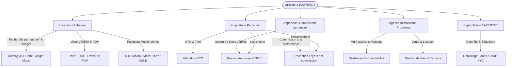
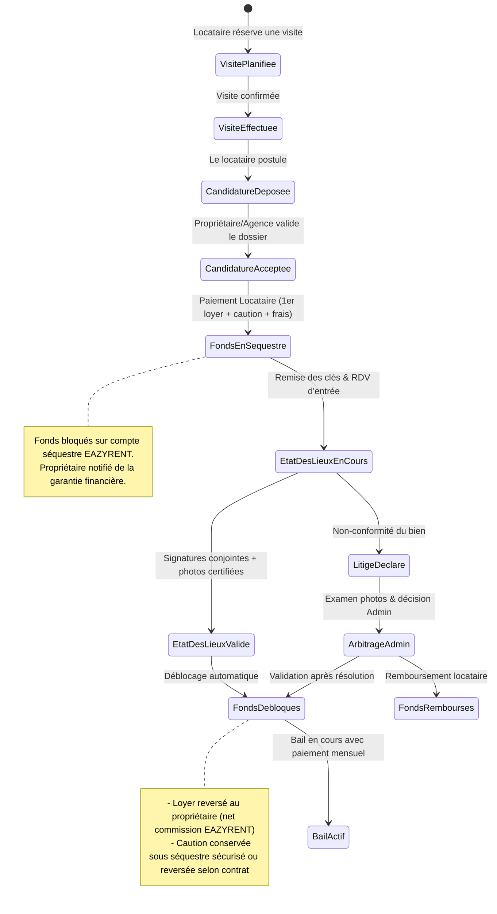

# 📱 EAZYRENT - Product Requirements Document (PRD)

**Version :** 2.0.0  
**Statut :** Révisé après audit de cohérence marché (`AUDIT_COHERENCE_BENIN.md`)  
**Date :** Août 2026  
**Marché du MVP :** **Bénin — Grand Nokoué** (Cotonou, Abomey-Calavi, Sèmè-Podji, Porto-Novo)  
**Écosystème :** Flutter (Android-first) + Supabase + FedaPay / KkiaPay / CinetPay (MTN MoMo, Moov Flooz, Celtiis Cash)

> **Documents liés :** `UX_CORE_SPEC.md` (structure d'expérience), `GROWTH_MONETISATION.md` (économie unitaire et acquisition), `AUDIT_COHERENCE_BENIN.md` (écarts et risques), `GATES.md` (portes d'acceptation).

---

## 1. 🎯 Vision & Proposition de Valeur

**EAZYRENT** digitalise le cycle locatif au Bénin, en commençant par le point où le chercheur de logement perd réellement de l'argent : le déplacement à l'aveugle. L'expansion à la zone UEMOA est une ambition d'année 2, pas le périmètre du MVP.

### 1.1 Le problème principal (formulation précise)

> **À Cotonou, chercher un logement coûte de l'argent avant d'avoir trouvé quoi que ce soit.**
> Chaque bien vu se paie : 300 à 1 000 F de zémidjan aller-retour, plus 500 à 2 000 F au démarcheur. Et le plus souvent on se déplace pour rien : le bien est déjà loué, le prix n'est pas celui annoncé, il n'y a pas d'eau, ou l'adresse ne correspond à rien. **Un chercheur brûle 10 000 à 20 000 F et deux à trois semaines pour 8 à 12 déplacements dont un seul aboutit.**

Problèmes secondaires traités : opacité des frais, états des lieux papier contestés, recouvrement des loyers non tracé, absence de garantie financière entre les parties.

**Problème non traité au lancement, et assumé comme tel :** l'**avance** de plusieurs mois exigée par les bailleurs. C'est la douleur la plus lourde en montant, elle sort du périmètre d'une application seule (cf. `AUDIT_COHERENCE_BENIN.md` §3).

### 1.2 Notre solution & Facteur X (Différenciateur Majeur)

- **La Visite Vérifiée** — la fonctionnalité centrale, indissociable de ses trois composants : (1) un tour 360 complet pièce par pièce **tourné sur place par un agent EAZYRENT**, (2) une **disponibilité re-confirmée et datée**, (3) un **prix ferme affiché**, avance et caution comprises. Un tour 360 d'un bien déjà loué n'a aucune valeur : c'est le grief exact adressé au démarcheur.
- **Pass Visite Vérifiée — 1 000 FCFA, 100 % EAZYRENT** : le tarif rémunère la production terrain (déplacement de l'agent, caméra 360, post-production, diffusion). Le bailleur est rémunéré par la location, jamais par la visite. Accès **permanent au bien acheté tant que l'annonce est en ligne**, et consultable **hors-ligne**. La **première visite de chaque nouvel utilisateur est offerte**. Grille et packs : `GROWTH_MONETISATION.md` §3.
- **Séquestre Financier (Escrow Automatisé)** — 🔴 **conditionné à la conformité BCEAO** (compte de cantonnement chez une banque partenaire ou délégation à l'agrégateur agréé). Voir `AUDIT_COHERENCE_BENIN.md` §6 R-1. Ne pas développer avant validation.
- **KYC & Badges de Confiance** : vérification d'identité, de propriété (CPF/ANDF) ou de mandat de gestion (RCCM) avant publication.
- **État des Lieux Numérique Certifié & Offline-First** : photo géolocalisée et horodatée même sans réseau.
- **Paiements Mobile Money Intégrés** : **MTN MoMo**, **Moov Africa Flooz**, **Celtiis Cash**, carte bancaire (diaspora), avec quittances numériques instantanées.
- **Mode Casque VR stéréoscopique** : différé hors du chemin critique. Parc de casques quasi nul au Bénin ; conservé comme outil de démonstration terrain.

---

## 2. 👥 Profils d'Utilisateurs (Personas)

### 2.1 Le Locataire / Client

- **Besoins** : Trouver rapidement un logement certifié selon ses critères (loyer total, quartier, commodités comme compteur électrique prépayé/eau), planifier des visites et payer sans risque de se faire escroquer.
- **Actions clés** : Recherche par carte, visites virtuelles, réservation avec dépôt en séquestre, signature de l'état des lieux sur smartphone, téléchargement des quittances, paiement mensuel du loyer via Mobile Money.

### 2.2 Le Propriétaire Particulier (Bailleur)

- **Besoins** : Trouver des locataires solvables, automatiser l'encaissement des loyers, sécuriser la caution et disposer de preuves légales lors de l'état des lieux.
- **Actions clés** : Dépôt de pièce d'identité et titre/attestation, publication d'annonces avec photos/vidéos, acceptation/refus des demandes de visite, validation de l'état des lieux d'entrée/sortie, réception des fonds directement sur son compte Mobile Money / bancaire.

### 2.3 L'Agence Immobilière / Promoteur

- **Besoins** : Gérer un portefeuille étendu de biens (locations résidentielles, meublés courte durée, ventes de parcelles/maisons avec CPF délivré par l'ANDF ou titre foncier ancien régime), superviser ses agents commerciaux, suivre les encaissements et taux d'occupation.
- **Actions clés** : Gestion multi-annonces, tableau de bord comptable (loyers collectés, impayés, commissions d'agence), export des rapports financiers, gestion des mandats.

### 2.4 L'Apporteur / Démarcheur partenaire *(rôle ajouté après audit)*

- **Constat** : le démarcheur connaît 30 à 50 propriétaires de son quartier. C'est la meilleure force d'acquisition d'offre disponible. Le combattre revient à se priver du stock ; le recruter revient à lui retirer la seule partie de son métier qui nuit à l'utilisateur — le déplacement payant et inutile.
- **Besoins** : conserver son revenu, gagner en volume, disposer d'un statut visible.
- **Actions clés** : apporter un bien, le faire vérifier et tourner par un agent EAZYRENT, suivre ses biens et ses commissions.
- **Rémunération** : 1 000 F par bien publié et vérifié, 3 000 F supplémentaires si le bien est loué via l'application.
- ⚠️ Le rôle `broker` doit être ajouté à l'énumération `user_role` du schéma.

### 2.5 L'Agent de terrain EAZYRENT

- **Besoins** : tourner 5 biens par jour en tournée de quartier, re-confirmer les disponibilités, produire les hotspots.
- **Contrainte industrielle** : le nombre de biens tournés par agent et par jour est le facteur limitant de toute l'entreprise (cf. `GROWTH_MONETISATION.md` §5).

### 2.6 Le Super-Admin EAZYRENT

- **Besoins** : Contrôler la conformité légale (KYC), superviser les flux financiers séquestrés, gérer les litiges et paramétrer les taux de commission.

### 2.7 Analyse concurrentielle *(section manquante, ajoutée après audit)*

| Concurrent | Force | Faille exploitée par EAZYRENT |
| :--- | :--- | :--- |
| Démarcheur informel | Connaît le stock réel, confiance locale | Fait payer le déplacement, montre des biens déjà loués |
| Groupes Facebook / WhatsApp | Gratuits, massifs, immédiats | Annonces mortes jamais retirées, prix faux, photos volées |
| CoinAfrique & petites annonces | Volume, notoriété | Aucune vérification, aucune fraîcheur garantie |
| Agences immobilières | Formelles, mandats | Chères, stock limité au haut de gamme |

**Le trou du marché :** personne ne garantit qu'un bien annoncé est **encore libre**.

---

## 3. ⚙️ Matrice des Fonctionnalités par Rôle

| Module | Locataire | Propriétaire | Agence Immobilière | Super Admin |
| :--- | :---: | :---: | :---: | :---: |
| **Authentification OTP (SMS / WhatsApp / Email)** | ✅ | ✅ | ✅ | ✅ |
| **Vérification KYC (CNI, Titre de propriété, RCCM)** | Optionnel | ✅ (Obligatoire) | ✅ (Obligatoire) | Validateur |
| **Recherche & Filtres Bénin (SBEE prépayé, SONEB / forage)** | ✅ | - | - | - |
| **Carte Interactive & Calcul d'itinéraire (`google_maps_flutter`)** | ✅ | ✅ | ✅ | ✅ |
| **Visite Vérifiée 360° — production** | ✅ (Lecture après Pass) | Demande de shooting | Demande de shooting | Modération |
| **Capture 360° sur place** | - | ❌ *(jamais d'upload par un tiers)* | ❌ | ✅ Agents EAZYRENT uniquement |
| **Prise de Rendez-vous de visite avec rappels** | ✅ | ✅ | ✅ | - |
| **Paiement Séquestre (1er loyer + Caution)** | ✅ (Payeur) | ✅ (Bénéficiaire) | ✅ (Bénéficiaire) | Gestionnaire |
| **Paiement Loyers Mensuels Mobile Money / CB** | ✅ | ✅ | ✅ | Supervision |
| **État des Lieux Numérique Photo (Offline-First)** | ✅ (Signature) | ✅ (Saisie/Sign) | ✅ (Saisie/Sign) | Audit |
| **Contrat de bail numérique & Quittances PDF** | ✅ (Consultation) | ✅ (Gestion) | ✅ (Gestion) | Archivage |
| **Dashboard Statistiques & Comptabilité Pro** | - | Basique | ✅ Avancé | Global |
| **Messagerie Instantanée Sécurisée (Realtime)** | ✅ | ✅ | ✅ | Modération |
| **Gestion des Litiges & Remboursements** | ✅ (Signalement) | ✅ (Réponse) | ✅ (Réponse) | Arbitre |

---

## 4. 💰 Modèle Économique & Règles de Gestion

### 4.1 Modèle de Monétisation EAZYRENT

1. **Pass Visite Vérifiée — 1 000 FCFA, 100 % EAZYRENT** *(source de revenu n°1 du MVP)* :
   - **Première visite offerte** à chaque nouvel utilisateur : on ne vend pas une expérience jamais vécue.
   - Packs : 3 visites 2 500 F (cible), 7 visites 5 000 F (ancre haute). Crédits valables 90 jours. 1 visite offerte par semaine aux comptes actifs.
   - **Accès permanent** au bien acheté tant que l'annonce est en ligne, et **consultable hors-ligne**. *(La validité 48 h de la v1.0 est supprimée : elle était punitive et génératrice de litiges.)*
   - **Remboursement automatique en crédit, sans réclamation**, si le bien devient indisponible après achat.
   - Répartition : **100 % pour EAZYRENT**. Le bailleur est rémunéré par la location, jamais par la visite. *(Lève la contradiction de la v1.0 entre le §1.2 et le §4.1.)*
   - **Certification Qualité EAZYRENT** : tournage sur place par nos agents terrain, avec identité de l'agent et date affichées sur la fiche.
2. **Pack Visibilité 360 — 5 000 FCFA, payé par le bailleur** *(source de revenu n°2 du MVP, absente de la v1.0)* :
   - Couvre 3,3× le coût de production d'un tour (≈ 1 500 F en tournée groupée), ce qui rend chaque Pass vendu quasi intégralement margé.
   - **Règle : aucun bien n'est tourné à l'aveugle.** Un bien n'est shooté que s'il a démontré une demande sur sa version photo simple (≥ 40 vues ou ≥ 8 mises en liste sous 72 h).
3. **Offre Recherche à distance — 25 000 FCFA (diaspora)** : 5 biens tournés sur critères + visite commentée en direct par un agent + dossier et bail à distance. Segment au consentement à payer le plus élevé, ignoré par la v1.0.
4. **Commission sur Location longue durée** : $X\%$ sur le premier loyer — 🔴 conditionnée à la conformité BCEAO du séquestre.
5. **Commission sur Meublés courte durée** et **Vente immobilière** : phases ultérieures.

> Économie unitaire détaillée, seuils de rentabilité et hypothèses de coût : `GROWTH_MONETISATION.md` §2.

### 4.2 Machine à États du Processus Locatif & Séquestre

---

## 5. 📶 Exigences Spécifiques au Contexte UEMOA (Offline-First & Réseau)

1. **Robustesse réseau** :
   - Synchronisation asynchrone pour les photos d'état des lieux (compression locale WebP, upload en tâche de fond dès que la connectivité est rétablie).
   - Cache persistant des annonces consultées et des quittances de loyer au format PDF local.
2. **Canaux de communication prioritaires** :
   - Envoi de SMS transactionnels via passerelle locale (ex: Termii, Twilio, Infobip) pour les utilisateurs sans connexion de données permanente.
   - Intégration de notifications WhatsApp Business pour les rappels d'échéances de loyer et confirmations de visite.
3. **Filtres de recherche hyper-localisés — référentiel béninois** :
   - **Électricité (SBEE)** : compteur individuel prépayé (« compteur à carte ») / compteur post-payé individuel / **sous-compteur partagé revendu par le bailleur** — dans ce dernier cas, le **prix du kWh revendu doit être affiché en clair** : c'est une source de litige majeure à Cotonou, pas une simple case à cocher.
   - **Eau** : réseau **SONEB** / forage privé / château ou citerne / pas de point d'eau sur la parcelle.
   - **Sécurité & accès** : voie bitumée ou latéritique, zone inondable en saison des pluies *(critère décisif à Cotonou et Godomey, absent de la v1.0)*, clôture, gardien, caméras.
   - **Foncier (segment vente)** : **Certificat de Propriété Foncière (CPF) délivré par l'ANDF** — seul titre définitif ; Titre Foncier ancien régime en cours de conversion ; attestation de recasement ; convention de vente ; permis d'habiter. *(La v1.0 citait l'ACD, instrument ivoirien.)*
   - **Conditions financières affichées en clair** : loyer, **avance** demandée en nombre de mois, caution, frais éventuels. L'avance est le premier critère de tri réel d'un chercheur béninois.

4. **Contraintes d'appareil et de données** *(section ajoutée)* :
   - **Android-first.** Parc réel : Tecno / Infinix / itel / Samsung A, 2 à 4 Go de RAM, Android 10-13. iOS différé.
   - **APK < 30 Mo**, distribuable par partage direct (WhatsApp, Bluetooth) — canal d'acquisition réel, à traiter comme tel.
   - **Budget de données par tour 360 plafonné** : résolution adaptative selon le GPU et le réseau, chargement progressif par tuiles, mode économie de données. Le « 60/120 fps » de la v1.0 n'est pas tenable sur GPU d'entrée de gamme.

---

## 6. 🏆 Critères d'Acceptation & Indicateurs Clés (KPIs)

### 6.1 KPI produit et business *(absents de la v1.0)*

| Indicateur | Définition | Cible d'amorçage |
| :--- | :--- | :---: |
| ★ **Visites Vérifiées terminées / semaine** | Métrique nord (≥ 80 % des pièces vues) | +15 %/semaine |
| **Activation** | % de nouveaux qui terminent un tour à J0 | ≥ 45 % |
| **Conversion payante** | % d'activés achetant un pass sous 7 j | ≥ 20 % |
| **Pass par bien tourné** | Rentabilité de la production | ≥ 3 (seuil), ≥ 6 (cible) |
| **Taux de fraîcheur** | % de biens confirmés disponibles à J+7 | ≥ 85 % |
| **Délai publication → 1ʳᵉ vue** | Vitesse de l'alerte quartier | < 30 min |
| **Taux de remboursement** | Pass remboursés (bien indisponible) | < 5 % — **> 10 % = arrêt** |
| **Biens tournés / agent / jour** | Contrainte industrielle | ≥ 5 |
| **Coût d'acquisition d'un payant** | Dépense ÷ payants | < 1 500 F |

### 6.2 KPI techniques

- **Temps de chargement du feed** : < 1,5 s sur 3G. Impose un budget de poids par écran, non défini dans la v1.0 — à établir avant la Phase 1.
- **Taux de succès Mobile Money** : > 98,5 %, avec **reprise automatique et bascule d'opérateur** en cas d'échec (les échecs MoMo sont fréquents : solde, réseau, timeout USSD ; un échec non rattrapé est un utilisateur perdu).
- **Intégrité de l'état des lieux** : 100 % signés, horodatés serveur, hash SHA-256, géolocalisation. À documenter comme **présomption** de preuve, pas comme certification (le hash prouve l'intégrité, pas l'identité du signataire).
- **Étanchéité du paywall 360** : 0 panorama complet accessible sans pass valide. URL signées ≤ 15 min générées par Edge Function, bucket privé, RLS active. *(Défaut bloquant de la v1.0 — cf. `AUDIT_COHERENCE_BENIN.md` §4.)*
- **Disponibilité** : 99,9 % d'uptime.
