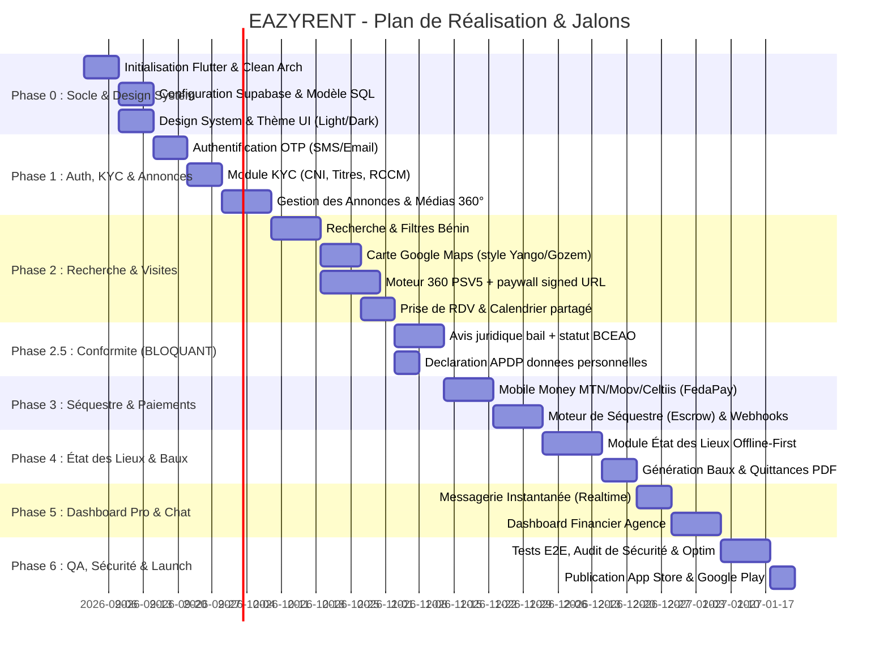

# 🗺️ EAZYRENT - Feuille de Route Complète & Plan de Développement (Roadmap)
**Projet :** EAZYRENT Mobile (Flutter **Android-first** + Supabase)  
**Marché du MVP :** Bénin — **un seul quartier pilote** du Grand Nokoué avant toute extension  
**Méthodologie :** BMAD (Agile Multi-Agent & Feature-Driven) + SpecKit + Unlazy (`GATES.md`)

> **Révision v2.0 après audit.** Changements structurants :
> - Le **stock d'annonces tournées est le facteur limitant**, pas le code. Un plan de recrutement d'agents terrain est ajouté (§Phase 0) : 1 agent = 5 biens/jour = ~110 biens/mois ; ~1 agent pour 2 quartiers.
> - Une **Phase 2.5 de conformité** est insérée **avant** la Phase 3 : sans avis juridique sur le bail (loi n°2018-12) et sans montage BCEAO, le séquestre ne peut pas être développé.
> - Le **mode Casque VR** sort du chemin critique (parc de casques quasi nul au Bénin).
> - **iOS et l'expansion UEMOA sont différés.**
> - Le Gantt v1.0 omettait les sprints Carte et Moteur 360 — soit le cœur du produit, ~3 semaines sous-estimées.
> - Séquence de lancement commerciale sur 90 jours : `GROWTH_MONETISATION.md` §8.

---

## 📅 Synthèse du Calendrier de Développement

---

## 🎯 Décomposition Détaillée par Phase & Sprints

### 🟢 Phase 0 : Fondations Techniques & Design System
- [ ] **Sprint 0.1 - Initialisation du Projet Flutter** :
  - Création du squelette Flutter avec la Clean Architecture (Presentation, Domain, Data).
  - Configuration de l'injection de dépendances (`get_it`, `injectable`).
  - Configuration du linter strict (`flutter_lints`) et de la gestion d'erreurs (`dartz` / `fpdart`).
- [ ] **Sprint 0.2 - Déploiement de l'Infrastructure Supabase** :
  - Déploiement des tables PostgreSQL, index spatiaux PostGIS pour la géolocalisation.
  - Configuration des règles de sécurité Row Level Security (RLS).
  - Création des buckets Supabase Storage (`listings_media`, `kyc_documents`, `inspection_photos`, `generated_leases`).
- [ ] **Sprint 0.3 - Design System & UI Kit EAZYRENT** :
  - Implémentation du thème clair/sombre avec palette moderne et contrastée.
  - Composants atomiques réutilisables : Boutons d'action, champs de saisie personnalisés, badges de statut, cartes de prévisualisation de biens, barres de progression.
  - ⚠️ Contrôle de contraste sur usage réel : écran d'entrée de gamme, en extérieur, en plein soleil. Vérifier `#FF4D2E` sur `#0B0F19` et la lisibilité de `#00E599`.
- [ ] **Sprint 0.4 - Montée en puissance de l'offre (piste parallèle, non technique)** :
  - Choix du **quartier pilote** sur données de rotation locative.
  - Recrutement et équipement de **2 agents de terrain** (caméra 360, trépied, moto) + **5 apporteurs / démarcheurs partenaires**.
  - Objectif avant toute communication grand public : **200 annonces dans le seul quartier pilote, dont 50 Visites Vérifiées**.
  - **Règle : aucun bien tourné à l'aveugle** — un bien n'est shooté qu'après avoir démontré une demande sur sa version photo simple (≥ 40 vues ou ≥ 8 mises en liste sous 72 h).
  - Cette piste conditionne tout le reste : sans stock, l'application n'a rien à montrer.

---

### 🔵 Phase 1 : Authentification, KYC & Gestion des Annonces
- [ ] **Sprint 1.1 - Authentification & Profils (Locataire / Propriétaire / Agence)** :
  - Connexion rapide par numéro de téléphone avec vérification OTP par SMS.
  - Choix du profil lors de l'onboarding avec flux personnalisé.
  - Gestion du profil, avatar, coordonnées et préférences de notifications.
- [ ] **Sprint 1.2 - Module de Vérification KYC (Confiance & Sécurité)** :
  - Upload et vérification des pièces d'identité (CNI, Passeport).
  - Pour les agences : Dépôt du Registre du Commerce (RCCM) et mandats de gestion.
  - Pour les propriétaires : Attestation de propriété / Titre foncier.
  - Interface d'administration pour validation et attribution du badge "Vérifié".
- [ ] **Sprint 1.3 - Module de Capture & Certification 360° Terrain (Agents EAZYRENT)** :
  - Interface dédiée pour les photographes/agents de terrain EAZYRENT pour le shoot des scènes 360° sur place.
  - Upload direct des panoramas équirectangulaires haute résolution avec compression automatique WebP.
  - Outil de positionnement des flèches et points de transition 3D (hotspots) entre les pièces.
  - Attribution automatique du badge "Visite 360° Certifiée par EAZYRENT".

---

### 🟡 Phase 2 : Recherche Avancée, Moteur 360°/VR & Visites
- [ ] **Sprint 2.1 - Moteur de Recherche & Filtres Hyper-Localisés (Bénin)** :
  - Recherche **par nom de quartier d'abord** (Fidjrossè, Agla, Kpota, Godomey…) : c'est ainsi qu'on cherche à Cotonou, pas en déplaçant une carte.
  - Filtres combinés : **coût total d'entrée** (avance + caution + frais), loyer, type, pièces, SBEE prépayé / sous-compteur, SONEB / forage, zone inondable, voie bitumée.
  - Badge "Visite Vérifiée EAZYRENT" + mention **"Confirmé disponible le JJ/MM"** sur chaque carte d'annonce (table `availability_checks`).
- [ ] **Sprint 2.2 - Cartographie Interactive Google Maps (Expérience Style Yango / Gozem)** :
  - ⚠️ Correction : la v1.0 citait **Mapbox** dans le PRD et la ROADMAP, et `google_maps_flutter` dans l'architecture. Une seule techno retenue : **`google_maps_flutter`**.
  - La carte est un **mode d'affichage du feed**, pas un onglet de navigation (cf. `UX_CORE_SPEC.md` §5.2).
  - Intégration avec thème Dark & Light sur-mesure (palette Obsidienne/Terracotta).
  - Génération dynamique de marqueurs personnalisés sous forme de bulles interactives avec prix en FCFA et badges 360° VR.
  - Carrousel horizontal de fiches de biens en bas d'écran avec synchronisation bi-directionnelle de la caméra (`animateCamera`).
  - Calcul en temps réel de la distance et tracé de l'itinéraire (Polyline) depuis la position GPS du client.
- [ ] **Sprint 2.3 - Moteur de Visite Vérifiée 360° (Photo Sphere Viewer 5)** :
  - Intégration du bundle Three.js + Photo Sphere Viewer 5 avec accélération matérielle.
  - Mode Gyroscope (déplacement fluide en tournant le smartphone).
  - **Preview gratuite délibérément frustrante** : 1 pièce, 90° explorables, flou progressif au-delà. Bucket public séparé. C'est le moteur de conversion — à instrumenter dès le premier jour.
  - **Paywall étanche** : bucket privé, RLS active, `signed_url` ≤ 15 min via Edge Function `get-tour-access`, filigrane compte. Sans cela le Pass est contournable par partage d'URL (cf. `ARCHITECTURE.md` §6.4).
  - **Pass Visite Vérifiée à 1 000 FCFA** par MTN MoMo / Moov Flooz / Celtiis Cash, **100 % des revenus pour EAZYRENT**. **Première visite offerte** à chaque nouvel utilisateur. **Accès permanent** au bien acheté tant que l'annonce est en ligne + **cache hors-ligne chiffré**. Packs 3 et 7 visites via `visit_credits`. Remboursement automatique en crédit si le bien devient indisponible.
  - Reprise automatique et bascule d'opérateur en cas d'échec Mobile Money.
  - ⚫ **Mode Casque VR stéréoscopique : hors périmètre du MVP**, conservé pour la démonstration terrain.
- [ ] **Sprint 2.4 - Module de Prise de Rendez-vous de Visite Physique** :
  - Définition des créneaux de disponibilité par le bailleur/l'agence.
  - Réservation de créneau par le locataire avec confirmation instantanée ou sur demande.
  - Synchronisation avec l'agenda du smartphone et rappels automatiques (Push, SMS, WhatsApp).

---

### 🚧 Phase 2.5 : Conformité — **bloque la Phase 3**
- [ ] **Sprint 2.5.1 - Avis juridique béninois sur le bail** :
  - Loi n°**2018-12** du 2 juillet 2018 portant régime juridique du bail à usage d'habitation : plafonds applicables à l'**avance** et à la **caution**.
  - Décision produit : plafonner dans l'application et se positionner comme **le canal conforme** (argument de différenciation fort), ou ne pas modéliser l'avance.
- [ ] **Sprint 2.5.2 - Montage de détention des fonds (BCEAO)** :
  - Arbitrer entre **compte de cantonnement** en banque partenaire et **délégation de conservation** à l'agrégateur agréé.
  - ⛔ **Aucune ligne de code d'escrow avant la conclusion de ce sprint.**
- [ ] **Sprint 2.5.3 - Protection des données (loi n°2017-20, APDP)** :
  - Déclaration du traitement, politique de conservation, chiffrement des documents KYC, purge programmée.
  - Correction de la politique RLS `profiles` exposant les numéros de téléphone (déjà appliquée au schéma v2.0).

> Ces trois sprints sont consignés comme **handoff** dans `GATES.md:G8` : ils requièrent un conseil externe et ne peuvent pas être tranchés en interne.

---

### 🟠 Phase 3 : Séquestre Financier (Escrow) & Paiements Mobile Money
- [ ] **Sprint 3.1 - Intégration Passerelle Mobile Money (Bénin)** :
  - Connexion à l'agrégateur : **FedaPay** ou **KkiaPay** (béninois, MTN + Moov natifs), **CinetPay** en repli régional.
  - Canaux : **MTN MoMo**, **Moov Africa Flooz**, **Celtiis Cash**, carte bancaire (diaspora).
  - ⚠️ La v1.0 citait Wave, Orange Money et Paystack : aucun des trois n'est exploitable au Bénin.
  - Reprise automatique des paiements échoués + bascule d'opérateur proposée (les échecs MoMo sont fréquents et un échec non rattrapé fait perdre l'utilisateur définitivement).
- [ ] **Sprint 3.2 - Moteur de Séquestre Automatisé (Escrow Engine)** :
  - Verrouillage du premier loyer et du dépôt de garantie (caution) sur le compte séquestre.
  - Notification automatique au propriétaire garantissant la solvabilité du locataire.
  - Supabase Edge Functions pour la gestion des webhooks de paiement avec vérification de signature.
  - Système de déblocage automatique des fonds lors de la signature de l'état des lieux d'entrée.

---

### 🟣 Phase 4 : État des Lieux Numérique & Baux Numériques
- [ ] **Sprint 4.1 - État des Lieux Certifié (Offline-First)** :
  - Grille d'inspection pièce par pièce (entrée, salon, cuisine, chambres, sanitaires, compteurs).
  - Capture de photos obligatoires par pièce avec horodatage et coordonnées GPS inviolables.
  - Signature tactile électronique conjointe propriétaire et locataire sur l'écran.
  - Base de données locale Drift pour une exécution 100% hors-ligne et synchronisation en tâche de fond.
- [ ] **Sprint 4.2 - Contrats de Bail & Quittances de Loyer Automatisées** :
  - Génération automatique du contrat de bail au format PDF conforme à la législation locale.
  - Émission et archivage des quittances de loyer mensuelles téléchargeables après chaque paiement validé.

---

### 🔴 Phase 5 : Dashboard Pro Agence, Messagerie & Notifications
- [ ] **Sprint 5.1 - Messagerie Instantanée Sécurisée (Realtime Chat)** :
  - Canaux de discussion sécurisés entre locataires et propriétaires/agences.
  - Envoi de pièces jointes (photos, devis, fiches d'information).
  - Indicateurs de message lu, en ligne et notifications en temps réel.
- [ ] **Sprint 5.2 - Tableau de Bord de Gestion pour Agences Immobilières** :
  - Vue d'ensemble du parc immobilier : taux d'occupation, logements vacants.
  - Suivi financier des encaissements, loyers en retard, commissions perçues.
  - Export comptable des états financiers (PDF / Excel).
- [ ] **Sprint 5.3 - Moteur de Notifications Multi-Canal** :
  - Notifications Push via Firebase Cloud Messaging (FCM).
  - Alertes SMS et WhatsApp pour les échéances de loyer et confirmations critiques.

---

### ⚫ Phase 6 : Assurance Qualité, Sécurité & Déploiement
- [ ] **Sprint 6.1 - Tests & Validation** :
  - Tests unitaires et tests de BLoC avec `bloc_test`.
  - Tests d'intégration et scénarios de paiement en environnement Sandbox.
  - Tests de synchronisation hors-ligne sur appareils physiques avec interruption réseau.
- [ ] **Sprint 6.2 - Audit de Sécurité & Optimisation** :
  - Audit des politiques Supabase RLS et chiffrement des données de paiement.
  - Optimisation de la taille du bundle d'application et des temps de rendu graphique (Impeller).
- [ ] **Sprint 6.3 - Publication & Mise en Production (Android-first)** :
  - Pipeline CI/CD pour les builds Android (AAB **et APK signé distribuable directement**).
  - Déploiement sur Google Play Store.
  - **Distribution par APK partagé** (WhatsApp, Bluetooth) traitée comme un canal d'acquisition à part entière : code de parrainage saisissable manuellement, pas seulement par lien.
  - ⚫ **iOS différé** : parc marginal au Bénin, coût de build et de certification non justifié au lancement.

---

## 🚫 Hors périmètre du MVP (décisions d'audit)

| Élément | Raison | Reprise |
| :--- | :--- | :--- |
| Mode Casque VR stéréoscopique | Parc de casques quasi nul | Démonstration terrain uniquement |
| iOS / App Store | Parc marginal | Après traction Android |
| Expansion UEMOA | Un modèle à agents terrain ne se lance pas sur 8 pays | Année 2 |
| Vente de parcelles | Segment distinct, risque foncier propre | Après le locatif |
| Meublé courte durée | Autre marché, autre cycle | Après le locatif |
| Dashboard agence complet | Rien à afficher sans volume | Phase 5, après traction |
