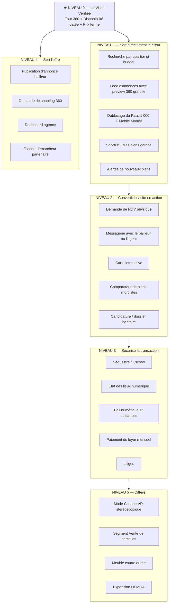
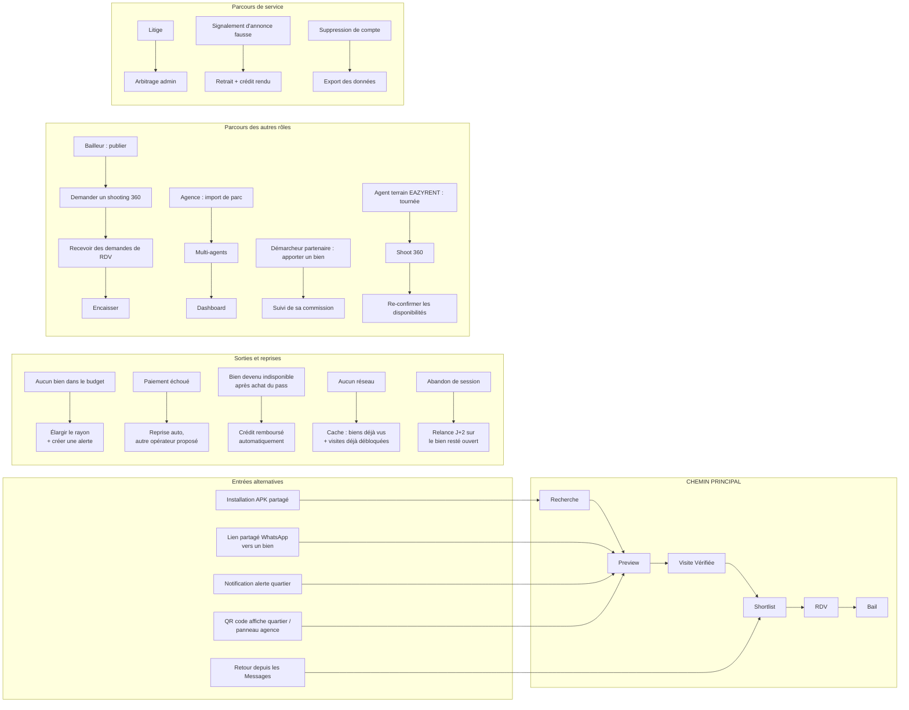
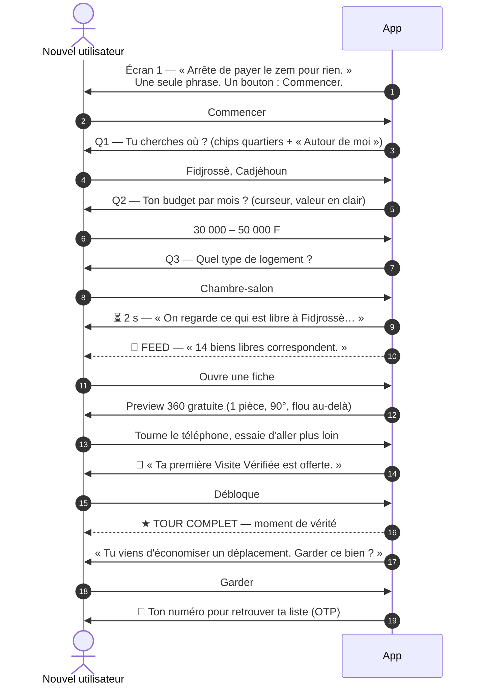

# 🧭 EAZYRENT — Spécification UX Fondamentale

**Marché :** Bénin — Grand Nokoué (Cotonou, Abomey-Calavi, Sèmè-Podji, Porto-Novo)
**Portée :** structure d'expérience de l'application mobile. Aucune décision visuelle ici (couleurs, composants, écrans dessinés → phase UI).
**Règle de construction :** chaque section découle de la précédente. Rien n'entre dans le produit s'il ne se rattache pas à la §2.

---

## 1. Le problème que nous résolvons

### 1.1 Formulation imprécise (à bannir)
> « Trouver un logement est difficile et il y a des arnaques. »

Inutilisable : trop large pour arbitrer une fonctionnalité.

### 1.2 Formulation précise (le problème réel)

> **À Cotonou, chercher un logement coûte de l'argent avant d'avoir trouvé quoi que ce soit.**
> Chaque bien vu se paie : 300 à 1 000 F de zémidjan aller-retour, plus 500 à 2 000 F au démarcheur qui « fait déplacer ». Et dans la majorité des cas, on se déplace pour rien : le bien est déjà loué, le prix annoncé n'est pas le prix demandé, il n'y a pas d'eau, ou l'adresse ne correspond à rien.
> **Un chercheur dépense 10 000 à 20 000 F et deux à trois semaines pour 8 à 12 déplacements dont un seul aboutit.**

### 1.3 Le problème réduit à sa formule

**Le déplacement est payant, l'information est gratuite mais fausse.**
EAZYRENT inverse cela : **l'information devient payante mais vraie, et le déplacement devient rare.**

### 1.4 Ce qu'on ne prétend pas résoudre au lancement
- L'**avance** de plusieurs mois exigée par les bailleurs (douleur n°1 en montant, hors de portée d'une app seule — cf. `AUDIT_COHERENCE_BENIN.md` §3 et §6).
- La pénurie de logements dans les quartiers recherchés.

Nommer ces limites protège la crédibilité de la promesse. Une app qui prétend tout résoudre n'est crue sur rien.

### 1.5 Douleur miroir, côté offre
Le bailleur, lui, subit l'inverse : **des visites qui ne servent à rien**. Il ouvre sa maison à dix curieux non solvables, perd ses journées, et paie un démarcheur qui ne filtre personne. La même fonctionnalité résout les deux côtés — c'est ce qui la rend défendable.

---

## 2. La fonctionnalité principale

### 2.1 Elle porte un nom, pas une technologie

> **La Visite Vérifiée**

Ce n'est pas « la visite VR ». La VR est le moyen. La valeur est composée de trois éléments **indissociables** :

| Composant | Ce qu'il tue |
|---|---|
| **Le tour 360 complet, pièce par pièce**, tourné par un agent EAZYRENT | Les photos flatteuses qui cachent la fissure et la cour partagée |
| **La disponibilité re-confirmée**, datée du jour (« Confirmé disponible aujourd'hui, 09 h 12 ») | Le déplacement vers un bien déjà loué |
| **Le prix ferme affiché**, avance et caution comprises, engagement du bailleur | Le prix qui double quand on arrive sur place |

Retirer l'un des trois casse la promesse. **Un tour 360 d'un bien déjà loué est pire que rien** : c'est le grief exact adressé au démarcheur.

### 2.2 Le moment de vérité (aha moment)
> L'utilisateur ouvre un tour 360, tourne son téléphone, découvre que la « douche » est en réalité un seau dans la cour — **et il n'a pas bougé de chez lui.**

Tout le produit existe pour amener chaque nouvel utilisateur à ce moment **le plus vite possible**, avant toute demande de compte et avant toute demande d'argent.

### 2.3 Métrique nord (North Star)
> **Nombre de Visites Vérifiées consommées jusqu'au bout par semaine**
> (« jusqu'au bout » = au moins 80 % des pièces du bien vues)

Elle capture simultanément la valeur reçue par l'utilisateur, l'usage du stock d'annonces produit, et le revenu. Métriques d'appui : taux de conversion visite → shortlist, taux visite → demande de RDV, taux de biens encore disponibles à J+7.

---

## 3. Hiérarchisation de toutes les fonctionnalités

Tout se classe par **distance à la Visite Vérifiée**.



### 3.1 Règle d'arbitrage
> Une fonctionnalité de niveau N ne démarre pas tant qu'une fonctionnalité de niveau N-1 n'est pas livrée et mesurée.

### 3.2 Conséquences sur la ROADMAP existante
- Le **mode Casque VR** (ROADMAP S2.3) passe en niveau 5 : coût élevé, parc de casques inexistant. Conservé comme outil de démonstration terrain, hors chemin critique.
- La **carte** (S2.2) passe en niveau 2 : à Cotonou, on cherche par **nom de quartier** (« Fidjrossè », « Agla », « Kpota »), pas en déplaçant une carte. La carte sert à vérifier *après* avoir shortlisté, pas à chercher.
- L'**escrow** (Phase 3) reste niveau 3 mais est **bloqué** par la conformité BCEAO (`AUDIT_COHERENCE_BENIN.md` §6, R-1).
- L'**espace démarcheur** est ajouté : absent des docs, il conditionne le remplissage du stock.

---

## 4. Le User Flow principal

Un seul parcours canonique, du premier lancement à la première valeur, puis à la première conversion.

```mermaid
flowchart TD
    S0([Premier lancement — aucun compte]) --> S1[Q1 : Tu cherches dans quel quartier ?<br/>Chips de quartiers + géoloc]
    S1 --> S2[Q2 : Ton budget mensuel ?<br/>Slider 15k → 300k F]
    S2 --> S3[Q3 : Quel type ?<br/>Chambre / Chambre-salon / 2 ch-salon / Appartement / Boutique]
    S3 --> S4[["FEED — 12 biens correspondants<br/>déjà visibles, sans inscription"]]

    S4 --> S5[Ouverture d'une fiche bien]
    S5 --> S6[["PREVIEW 360 GRATUITE<br/>1 pièce, 90° explorables,<br/>flou progressif au-delà"]]
    S6 --> S7{Le bien intéresse ?}

    S7 -->|Non| S4
    S7 -->|Oui| S8[["🎁 1ʳᵉ VISITE VÉRIFIÉE OFFERTE<br/>Toutes les pièces, sans payer"]]

    S8 --> S9[["★ AHA MOMENT<br/>Tour complet exploré"]]
    S9 --> S10[Micro-victoire : « Tu as tout vu.<br/>Tu viens d'économiser un déplacement. »]
    S10 --> S11[Ajout à la shortlist]
    S11 --> S12[/"Création de compte par OTP<br/>— demandée MAINTENANT, pas avant"/]

    S12 --> S13[Activation de l'alerte quartier]
    S13 --> S14[Retour au feed — 2ᵉ bien intéressant]
    S14 --> S15{Pass requis}
    S15 --> S16[[Paiement 1 000 F — MTN MoMo / Moov Flooz]]
    S16 --> S17[Visite Vérifiée n°2]

    S17 --> S18[Shortlist de 3 à 5 biens]
    S18 --> S19[Demande de RDV physique sur 1 ou 2 biens seulement]
    S19 --> S20([Visite physique → candidature → bail])

    style S8 fill:#0B0F19,color:#fff
    style S9 fill:#FF4D2E,color:#fff
    style S16 fill:#00E599,color:#000
```



### 4.1 Les quatre décisions structurantes de ce flow

1. **Aucune inscription avant la valeur.** Le mur d'inscription en premier écran est la première cause d'abandon sur ce marché (numéro de téléphone = méfiance immédiate, « ils vont me spammer / me revendre »). Le compte est demandé **au moment où l'utilisateur veut garder quelque chose** — il devient alors un service rendu, pas un péage.
2. **La première Visite Vérifiée est offerte.** Effet de réciprocité et de dotation : on ne peut pas vendre 1 000 F une expérience que l'utilisateur n'a jamais vécue. Il faut qu'il ressente d'abord ce qu'il achète. C'est le levier le plus important du produit.
3. **La preview gratuite est délibérément frustrante.** Une pièce, 90° de rotation, flou au-delà. Elle crée une boucle ouverte (effet Zeigarnik) : on sait qu'il y a quelque chose à voir et on ne peut pas le voir. C'est le moteur de conversion.
4. **Le paiement arrive au deuxième bien**, quand l'habitude est amorcée et que la valeur est prouvée. Pas au premier.

---

## 5. La navigation principale

Elle est **dérivée du flow**, pas d'une convention de barre à cinq onglets.

### 5.1 Quatre onglets, jamais cinq

```
┌──────────────────────────────────────────────────────┐
│  🔎 Chercher   ⭐ Ma liste   💬 Messages   👤 Moi     │
└──────────────────────────────────────────────────────┘
```

| Onglet | Rôle unique | Contenu par défaut |
|---|---|---|
| **🔎 Chercher** | Le feed. Onglet d'atterrissage permanent. | Biens filtrés par la recherche active, triés par fraîcheur puis pertinence. Bascule Liste ⇄ Carte en haut à droite. |
| **⭐ Ma liste** | Tout ce que l'utilisateur possède déjà : shortlist, visites débloquées, comparateur, RDV. | Vide au départ → état vide **actif** : « Garde un bien ici pour le comparer plus tard. » |
| **💬 Messages** | Bailleurs, agents EAZYRENT, support. | Pastille de non-lus. |
| **👤 Moi** | Compte, passes restants, parrainage, bail en cours, quittances. | Change de contenu selon le stade de vie (voir §10). |

### 5.2 Pourquoi pas d'onglet « Carte »
La carte est un **mode d'affichage** du feed, pas une destination. Un onglet Carte dédié duplique le contenu, disperse l'attention, et sur ce marché la recherche est nominative (quartier), pas spatiale.

### 5.3 Pourquoi pas d'onglet « Publier »
Le bailleur et le chercheur sont deux états d'usage, pas deux applications. « Publier un bien » vit dans **Moi**, avec bascule de rôle. Un chercheur ne doit jamais voir un bouton Publier — c'est du bruit pour 95 % des sessions.

### 5.4 Le bouton d'action flottant
Un seul, contextuel, dans **Chercher** : **« Alerte quartier »** — active la notification pour la recherche courante. C'est l'action à plus fort rendement de rétention de tout le produit (cf. §8).

---

## 6. Les chemins secondaires

Une fois le chemin principal figé, tous les autres parcours possibles sont mappés et rattachés.



### 6.1 Chemins secondaires à ne surtout pas négliger

| Chemin | Pourquoi il est critique au Bénin |
|---|---|
| **Lien partagé WhatsApp** | Le partage se fait sur WhatsApp, pas dans l'app. Chaque fiche doit avoir un lien profond ouvrant directement la preview, même sans l'app installée (page web légère → installation). C'est le canal d'acquisition n°1, gratuit. |
| **Paiement échoué** | Les échecs Mobile Money sont fréquents (solde, réseau, timeout USSD). Un échec non rattrapé = un utilisateur perdu définitivement, avec le sentiment d'avoir « perdu son argent ». Reprise automatique + bascule d'opérateur + statut visible en clair, obligatoires. |
| **Bien devenu indisponible après achat** | C'est le point de rupture de confiance. **Remboursement automatique en crédit, sans réclamation, notifié.** Correctement traité, cet incident devient le meilleur générateur de confiance du produit. |
| **Aucun réseau** | Toute Visite Vérifiée payée est **téléchargée et conservée hors-ligne**. On a payé, on possède. C'est ce que l'utilisateur comprendra, et c'est ce qui doit être vrai. |
| **Installation par APK partagé** | Le partage d'APK de main en main est un usage réel. L'app doit rester fonctionnelle et attribuable (code de parrainage saisissable manuellement, pas seulement par lien). |

---

## 7. Actions clés et micro-victoires

Objectif : rendre l'usage habituel. Une habitude se construit par des victoires **petites, immédiates et visibles**, pas par des récompenses lointaines.

### 7.1 Les six actions clés

| # | Action | Fréquence visée | Micro-victoire déclenchée |
|---|---|---|---|
| A1 | Ouvrir le feed du quartier | Quotidienne | « **4 nouveaux biens** à Fidjrossè depuis hier. » — pastille + compteur |
| A2 | Explorer une preview 360 | Plusieurs fois/session | Progression : « Tu as vu 1 pièce sur 6 » + le flou qui recule |
| A3 | Terminer une Visite Vérifiée | 2 à 5 par semaine de recherche | « **Tour complet.** Tu as tout vu de ce logement sans bouger. » + haptique + compteur d'économies |
| A4 | Ajouter à la shortlist | 3 à 6 par recherche | La liste se remplit visiblement ; « Encore 2 biens et tu peux comparer. » |
| A5 | Activer une alerte quartier | Une fois, décisive | « Tu seras le premier prévenu. Les bons biens partent en 48 h. » |
| A6 | Demander un RDV | 1 à 2 en fin de parcours | « RDV demandé. **Tu y vas en sachant déjà tout.** » |

### 7.2 Le compteur d'économies — le mécanisme central

Un indicateur permanent, visible dans **Moi** et après chaque tour terminé :

```
  💰 Tu as économisé 6 500 F ce mois-ci
     5 visites faites depuis chez toi
     ≈ 5 déplacements évités (zem + démarcheur)
```

Pourquoi il fonctionne :
- Il transforme une **dépense** (1 000 F) en **gain net** affiché — comptabilité mentale ;
- Il s'incrémente à chaque usage : la valeur perçue croît avec l'utilisation (effet de dotation) ;
- Il produit une phrase que l'utilisateur peut **répéter à quelqu'un d'autre** — c'est ce qui devient du bouche-à-oreille.

**Contrainte d'honnêteté :** le calcul est basé sur un coût moyen de déplacement déclaré par l'utilisateur lui-même à l'onboarding (« combien te coûte un aller-retour vers un quartier ? »), pas sur un chiffre inventé. Un compteur qu'on soupçonne d'être gonflé détruit la confiance qu'il est censé construire.

### 7.3 Progression et boucles ouvertes

- **Barre de complétion du tour** : « 4/6 pièces vues ». L'effet de gradient d'objectif fait terminer les tours — et un tour terminé est notre métrique nord.
- **Shortlist incomplète** : « Ajoute 1 bien pour débloquer le comparateur. »
- **Dossier locataire** : « Ton dossier est prêt à 70 %. Les bailleurs répondent 3× plus vite aux dossiers complets. » (à ne dire que si c'est mesuré et vrai).
- **Crédits qui se rechargent** : 1 visite offerte tous les 7 jours pour les comptes actifs. Rendez-vous récurrent, sans coût marginal significatif, et raison légitime de revenir.

### 7.4 Ce qu'on refuse de faire

L'objectif est un usage **intense et court**, pas un usage compulsif : chercher un logement est un besoin épisodique de 2 à 6 semaines. Trois pratiques sont exclues :

- ❌ Fausse rareté (« 3 personnes regardent ce bien » quand c'est faux) — le produit est vendu sur la vérité, mentir sur ce point est un suicide de marque ;
- ❌ Séries/streaks quotidiennes obligatoires : elles culpabilisent et ne correspondent à aucune valeur réelle ;
- ❌ Notifications à heure fixe sans contenu neuf (voir §8).

**La vraie rétention longue durée ne vient pas du chercheur** — il part quand il a trouvé, et c'est un succès. Elle vient de deux comptes qui restent : le **locataire installé** (paiement du loyer, quittances, signalements) et le **bailleur** (encaissements, taux d'occupation). Le chercheur, lui, revient dans 18 mois — à condition que la sortie ait été mémorable (règle du pic-fin : la remise des clés doit être le meilleur moment de tout le parcours).

---

## 8. Notifications intelligentes

**Principe :** une notification ne s'envoie que si elle contient une **information neuve que l'utilisateur ne pouvait pas connaître** et qui appelle une action possible **maintenant**.

### 8.1 Le test à trois questions
Avant toute notification :
1. Contient-elle un fait nouveau ? *(Sinon : ne pas envoyer.)*
2. Ce fait est-il spécifique à cette personne ? *(Sinon : ne pas envoyer.)*
3. Peut-elle agir dans les 10 minutes ? *(Sinon : différer au bon moment.)*

### 8.2 Catalogue des notifications autorisées

| Déclencheur | Message | Moment | Pourquoi elle est légitime |
|---|---|---|---|
| **Nouveau bien correspondant à une alerte** | « 🏠 Chambre-salon à **Fidjrossè**, 35 000 F. Visite 360 dispo. Publié il y a 20 min. » | **Immédiat** (< 30 min après publication) | Les bons biens partent en 24-48 h. Être prévenu le premier **est** la valeur. C'est la seule notification qui justifie l'interruption. |
| **Baisse de prix sur un bien shortlisté** | « Le bien à Agla est passé de 60 000 à 52 000 F. » | Immédiat | Fait nouveau, personnel, actionnable. |
| **Bien shortlisté sur le point de partir** | « 2 personnes ont demandé un RDV sur le bien de Cadjèhoun aujourd'hui. » | Immédiat, **uniquement si vrai** | Aversion à la perte, fondée sur un fait réel. |
| **Disponibilité re-confirmée** | « ✅ Le bien de Kpota est toujours libre — vérifié ce matin. » | J+3 après shortlist | Réduit l'anxiété, relance sans rien vendre. C'est la notification de confiance. |
| **Tour interrompu** | « Il te reste 3 pièces à voir dans le bien de Godomey. » | J+1, **19 h-21 h** | Boucle ouverte + fenêtre où l'utilisateur est chez lui, au calme, avec du réseau. |
| **Crédit hebdomadaire** | « 🎁 Ta visite offerte de la semaine est là. » | Samedi 10 h | Le samedi matin est le moment de recherche de logement au Bénin. |
| **Échec de paiement** | « Ton paiement n'a pas abouti. Aucun montant débité. Réessayer avec Moov ? » | Immédiat | Rassure et récupère la transaction. |
| **RDV J-1 et J-2 h** | « Visite demain 15 h à Vèdoko. Itinéraire → » | J-1 18 h, puis J-2 h | Réduit les RDV manqués, qui coûtent au bailleur. |
| **Loyer à échéance** | « Ton loyer de mars, 45 000 F. Payer avec MoMo → quittance immédiate. » | J-3, J-1, jour J | Le seul rappel récurrent légitime. Canal **WhatsApp** en priorité, pas push. |
| **Quittance disponible** | « ✅ Quittance de mars reçue. » | À la validation | Peak-end : preuve tangible. |

### 8.3 Notifications explicitement interdites
- ❌ « Tu nous manques ! » / « Reviens vite ! » — aucun fait nouveau.
- ❌ « De nouveaux biens sont disponibles » sans quartier, ni prix, ni photo.
- ❌ Toute notification marketing entre 21 h et 7 h.
- ❌ Plus de **2 notifications par jour**, hors transactionnel (paiement, RDV, loyer).
- ❌ Notification de contenu quand aucun bien du quartier suivi n'a bougé.

### 8.4 Gouvernance
- Réglages par **type** d'alerte, pas un interrupteur unique tout-ou-rien.
- **Canal adapté au contenu** : push pour l'urgent et le contextuel ; **WhatsApp** pour le transactionnel important (loyer, quittance, RDV) parce qu'il est lu et archivé ; **SMS** en repli quand l'utilisateur est hors data — ce qui arrive tous les jours ici.
- **Budget d'attention** : si le taux d'ouverture d'un type d'alerte tombe sous 15 % sur 14 jours, la fréquence est automatiquement réduite avant que l'utilisateur ne coupe tout.

---

## 9. L'onboarding

**Objectif unique :** amener au moment de vérité (§2.2) en **moins de 90 secondes**, sans compte, sans paiement.

### 9.1 Séquence



### 9.2 Les règles de l'onboarding

| Règle | Justification |
|---|---|
| **Trois questions, jamais plus** | Chaque question supplémentaire coûte des utilisateurs (loi de Hick). Trois suffisent à produire un feed pertinent. |
| **Aucun écran de bienvenue à balayer (carrousel)** | Personne ne les lit. Montrer le produit vaut mieux que le décrire. |
| **Aucun compte avant la première valeur** | Le numéro de téléphone est demandé **après** le moment de vérité, pour un bénéfice concret (« retrouver ta liste »). |
| **La première Visite Vérifiée est offerte, sans conditions** | On ne vend pas une expérience jamais vécue. |
| **Aucun mot technique** | Jamais « VR », « 360° immersif », « panorama équirectangulaire » à l'écran. On dit : « **Visite ce logement comme si tu y étais.** » |
| **Le délai de 2 s est assumé** | Une attente courte, expliquée, avec le nom du quartier de l'utilisateur, augmente la valeur perçue du résultat. Elle ne doit jamais dépasser 3 s. |
| **Fonctionne en français simple** | Français standard, phrases courtes, tutoiement. Prévoir Fon et Yoruba en audio pour les écrans clés en phase 2 — pas de traduction textuelle intégrale (faible lectorat écrit dans ces langues). |

### 9.3 Onboarding du bailleur (parcours distinct)
Il n'a pas le même moment de vérité. Le sien est : **« Une demande de RDV vient d'arriver. »**
Séquence : 1 bien → 4 champs (quartier, prix, type, téléphone) → publication immédiate en « annonce simple » → proposition du shooting 360 gratuit **une fois qu'il a constaté que sa fiche est vue** (« 23 personnes ont vu ton bien. Avec une visite 360, tu recevrais 4× plus de demandes »). On lui prouve d'abord la demande, on lui vend l'outil ensuite.

---

## 10. Découverte progressive du reste du produit

Aucun module n'est présenté avant que l'utilisateur n'ait vécu la valeur qui le rend compréhensible.

### 10.1 Les paliers

| Palier | Condition d'entrée | Ce qui se débloque et s'affiche | Ce qui reste caché |
|---|---|---|---|
| **P0 — Curieux** | Premier lancement | Feed, preview, 1 visite offerte | Tout le reste |
| **P1 — Éveillé** | 1 tour complet terminé | Shortlist, compte OTP, alerte quartier | Escrow, bail, dashboard, RDV |
| **P2 — Chasseur** | 2 biens shortlistés ou 1 pass acheté | Comparateur, carte, messagerie, packs de visites, parrainage | Escrow, bail |
| **P3 — Candidat** | 1 RDV demandé | Dossier locataire, séquestre expliqué (fiche pédagogique, pas un formulaire), calendrier | Dashboard bailleur |
| **P4 — Locataire** | Bail actif | Onglet **Moi** transformé : loyer, quittances, état des lieux, contact bailleur, signalements | Modules chercheur mis en veille |
| **P5 — Bailleur** | Bascule de rôle explicite | Publication, demande de shooting, demandes reçues, encaissements | Dashboard agence multi-agents |
| **P6 — Pro** | 3 biens publiés ou compte agence | Multi-agents, comptabilité, exports, mandats | — |

### 10.2 Mécanique de révélation

- **Jamais de visite guidée générale.** Une seule bulle contextuelle au moment exact où la fonction devient utile, une seule fois, et jamais bloquante.
- **Le palier se voit par le contenu, pas par un badge.** L'onglet **Moi** en P4 ne ressemble plus du tout à l'onglet **Moi** en P1 : ce n'est pas un niveau gagné, c'est un outil qui apparaît quand on en a besoin.
- **Rien n'est affiché en grisé.** Une fonction verrouillée qu'on voit sans pouvoir l'utiliser produit de la frustration, pas du désir. Elle n'existe simplement pas à l'écran.
- **Une seule exception délibérée** : la preview 360 floutée. C'est le seul verrou volontairement visible du produit, parce que c'est celui qui convertit.

### 10.3 Le passage P3 → P4 est le plus délicat
C'est là qu'on demande de l'argent réel (séquestre) et des documents (KYC). Le séquestre doit être **expliqué avant d'être proposé**, en une fiche de trois phrases, avec un cas concret chiffré :

> « Tu paies 145 000 F. **EAZYRENT garde l'argent.**
> Le bailleur ne le reçoit que le jour où tu as les clés et que l'état des lieux est signé par vous deux.
> Si le logement ne correspond pas, tu es remboursé. »

Et un nom local compréhensible plutôt que le mot « séquestre » : **« Argent bloqué »** ou **« Compte de garantie »** — à tester sur cinq utilisateurs réels avant de figer.

---

## 11. Récapitulatif : la chaîne de décisions

```
Le déplacement à l'aveugle coûte cher et échoue (§1)
        ↓
La Visite Vérifiée le supprime (§2)
        ↓
Tout se hiérarchise par distance à elle (§3)
        ↓
Le flow amène à elle en 90 s, gratuitement, sans compte (§4, §9)
        ↓
La navigation ne sert qu'à la nourrir et à la capitaliser (§5)
        ↓
Tous les autres parcours s'y raccrochent ou la protègent (§6)
        ↓
Chaque usage produit une victoire visible et chiffrée (§7)
        ↓
On ne notifie que ce qui fait revenir pour une raison vraie (§8)
        ↓
Le reste du produit se révèle au rythme de la valeur vécue (§10)
```

---

## 12. À trancher avant la phase UI

1. Le nom local de la fonctionnalité principale : « Visite Vérifiée » vs « Visite Sûre » vs autre — **à tester sur le terrain**.
2. Le mot remplaçant « séquestre ».
3. Le coût de déplacement de référence pour le compteur d'économies : déclaré par l'utilisateur ou moyenne par quartier ?
4. Durée de validité d'un pass : 48 h (spec actuelle) est probablement une erreur — voir `GROWTH_MONETISATION.md` §3.
5. Périmètre exact de la preview gratuite (1 pièce ? le salon imposé ? 90° ou 180° ?) — c'est le réglage qui pilote directement le taux de conversion, à instrumenter dès le premier jour.
